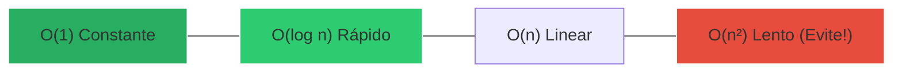
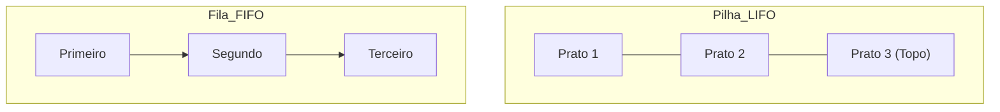

# 📊 Curso: Algoritmos e Estruturas de Dados

Este é o alicerce de toda a computação. Se você entende a lógica e como organizar os dados, você domina qualquer linguagem.

---

## 📈 A Escala Big O (Eficiência)

Como saber se seu código é rápido ou lento? Usamos a notação Big O para medir o crescimento do tempo conforme os dados aumentam.

::: tip 💡 Dica do Matheus
Em entrevistas para grandes empresas (FAANG), eles raramente perguntam a sintaxe da linguagem. Eles querem saber se você sabe transformar um código **O(n²)** em um **O(log n)** usando a estrutura de dados correta.
:::

---

## 🧱 Estruturas Essenciais

### 🥞 Pilhas vs 🚶 Filas
Entenda a diferença básica de fluxo:

| Estrutura | Sigla | Analogia | Uso Real |
| :--- | :--- | :--- | :--- |
| **Pilha** | LIFO | Pilha de pratos | Botão "Voltar" do navegador |
| **Fila** | FIFO | Fila do banco | Impressora enviando arquivos |

---

## 🌳 Árvores e Organização
Uma árvore binária de busca permite encontrar qualquer informação em milissegundos, mesmo entre milhões de registros.

::: info 🛡️ Na Trincheira: Caso Real
Um sistema de busca de produtos estava demorando **5 segundos** para achar um item em uma lista de 1 milhão. Troquei a busca linear (percorrer um por um) por uma **Árvore Binária de Busca**. O tempo caiu para **0.002 segundos**. O cliente achou que era mágica!
:::

---

## 📝 Procedimento Profissional: Clean Code

::: details 🧠 Checklist: Código de Elite (Clique para expandir)
Antes de entregar seu algoritmo, verifique:
1. [ ] **Nomes:** As variáveis explicam o que o dado é? (ex: `preco_total` vs `x`).
2. [ ] **Casos de borda:** O que acontece se a lista estiver vazia?
3. [ ] **Complexidade:** Existe um loop dentro de outro que poderia ser evitado?
4. [ ] **Comentários:** O código explica o "Porquê" e não o "O quê"?
:::

---

### Links Relacionados
- [🎨 POO na Prática](/guias/Curso_POO_Pratica)
- [🐍 Python para Automação](/guias/Curso_Python_Automacao)
- [🧮 Fundamentos CS](/guias/Curso_Fundamentos_CS)
