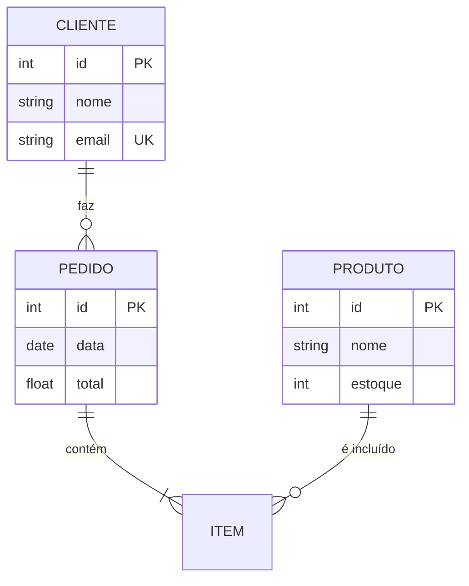

# 🗄️ Banco de Dados Avançado: Master Class Edition


Os dados são o novo petróleo. Aprenda a modelar, consultar, otimizar e proteger bancos de dados para aplicações de escala global. Este guia leva você do `SELECT` básico à arquitetura de dados de alta performance.

---

## 📂 Módulo 1: Arquitetura e Modelagem Relacional

O design correto do banco de dados (DER) evita duplicidade e garante a integridade dos sistemas.

### 1.1 O Modelo Entidade-Relacionamento (ERD)


### 1.2 Normalização (As 3 Leis de Ouro)
1.  **1ª Forma Normal (1NF):** Nada de valores repetidos na mesma célula. Cada campo é atômico.
2.  **2ª Forma Normal (2NF):** Todos os campos devem depender da **Chave Primária** inteira.
3.  **3ª Forma Normal (3NF):** Nada de campos que dependem de outros campos que não são a chave (ex: Cidade depende de CEP, não do ID do Usuário).

---

## 🛠️ Módulo 2: Maestria em SQL (Buscas Complexas)

### 2.1 O Poder dos JOINS
| Tipo | O que faz? | Quando usar? |
| :--- | :--- | :--- |
| **INNER JOIN** | Retorna apenas o que existe em ambas. | Ver pedidos de clientes ativos. |
| **LEFT JOIN**  | Retorna tudo da esquerda + correspondentes. | Ver TODOS os clientes, mesmo os sem pedidos. |
| **UNION**     | Une resultados de duas tabelas diferentes. | Criar lista única de fornecedores e clientes. |

### 2.2 Subconsultas e Agregações
```sql
-- Buscar o ticket médio de vendas por categoria
SELECT categoria, AVG(preco) as media
FROM produtos
GROUP BY categoria
HAVING media > 100;
```

---

## ⚙️ Módulo 3: Performance e Otimização (O Segredo do DBA)

Um banco de dados rápido não é sorte, é engenharia.

### 3.1 Índices: A Agenda do Banco
Sem índices, o banco faz um **Full Table Scan** (lê linha por linha). Com índices (B-Tree), ele vai direto no endereço do dado.
- **Dica:** Indexe colunas usadas frequentemente no `WHERE` e no `JOIN`.

### 3.2 Transações e ACID
Garantem que os dados não corrompam se o sistema cair durante uma transferência bancária.
- **Atomicity:** Ou tudo acontece, ou nada acontece.
- **Consistency:** O banco sai de um estado válido para outro.
- **Isolation:** Uma transação não interfere na outra.
- **Durability:** Gravou? Está salvo mesmo se acabar a luz.

---

## 🛡️ Módulo 4: Segurança e Continuidade de Negócios

### 4.1 Contra o Inimigo (SQL Injection)
Nunca concatene strings no código! Use **Prepared Statements**.
- **Ruim:** `"SELECT * FROM usus WHERE id = " + id_usuario`
- **Bom:** `execute("SELECT * FROM usus WHERE id = ?", [id_usuario])`

### 4.2 Backup Master
1. **Cold Backup:** Banco desligado (mais seguro).
2. **Hot Backup:** Banco rodando (produção).
3. **Ponto de Restauração:** Use Logs de Transação para voltar o banco ao minuto exato antes de um erro.

---

## 🔬 Módulo 5: SQL vs NoSQL (A Escolha de Arquitetura)

| Característica | SQL (PostgreSQL/MySQL) | NoSQL (MongoDB/Redis) |
| :--- | :--- | :--- |
| **Estrutura** | Tabelas Rígidas | Documentos Flexíveis (JSON) |
| **Escala** | Vertical (Mais RAM/CPU) | Horizontal (Mais Máquinas) |
| **Uso Ideal** | E-commerce, Finanças, ERP | Redes Sociais, Logs, Big Data |

---

### Links de Referência Master
- [💻 Desenvolvimento Web](/guias/Guia_Desenvolvimento_Web) - APIs que consomem dados.
- [🐍 Python para Automação](/guias/Curso_Python_Automacao) - Scripts de backup e insert.
- [🏢 Windows Server & AD](/guias/Curso_Windows_Server_AD) - Instalando SQL Server.
