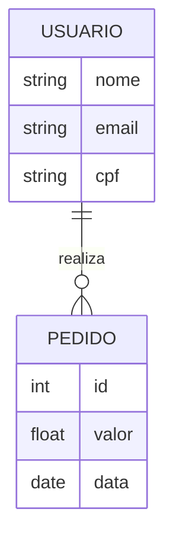

# 🗄️ Banco de Dados Avançado


Onde os dados ganham vida. Aprenda a modelar, consultar e otimizar bancos de dados para aplicações de alta performance.

---

## 📂 Arquitetura da Informação

Como os dados se relacionam? Entenda a estrutura de uma tabela profissional.



---

## 🛠️ Módulo 1: O Poder do SQL

### Consultas que Salvam o Dia
```sql
-- Buscar clientes que não compram há mais de 30 dias
SELECT nome, email 
FROM usuarios 
WHERE ultima_compra < DATE_SUB(NOW(), INTERVAL 30 DAY);
```

::: tip 💡 Dica do Matheus
Sempre use **Índices** em colunas que você usa muito no `WHERE`. Isso pode fazer uma busca que demorava 10 segundos passar a demorar 0.01 segundos!
:::

---

## 🔧 Módulo 2: Administração e Segurança

### Backup e Recuperação
::: danger ⚠️ Alerta Crítico
Backup que não foi testado não é backup. Pelo menos uma vez por mês, tente restaurar seu banco de dados em um servidor de teste para garantir que os arquivos não estão corrompidos.
:::

---

## 🔍 Módulo 3: Troubleshooting de Performance

::: info 🛡️ Na Trincheira: Caso Real
Um sistema de vendas estava travando ao gerar o relatório mensal. Usei o comando `EXPLAIN ANALYZE` e descobri que o banco estava fazendo uma busca completa na tabela (Table Scan) em vez de usar o índice. **Solução:** Criei um índice composto e o relatório que demorava 5 minutos passou a ser instantâneo.
:::

---

### Links Relacionados
- [💻 Desenvolvimento Web](/guias/Guia_Desenvolvimento_Web)
- [🐍 Python para Automação](/guias/Curso_Python_Automacao)
