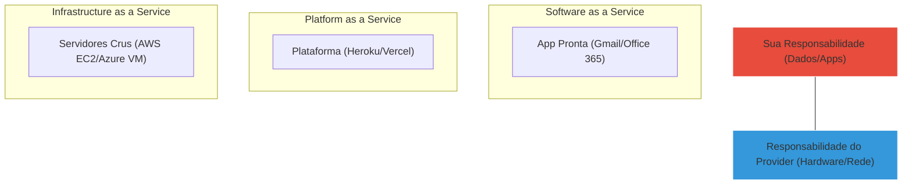

# ☁️ Curso: Cloud Computing Essentials

O céu não é o limite, é o seu novo data center. Aprenda os fundamentos da computação em nuvem e como as maiores empresas do mundo operam.

---

## 📂 O Modelo de Responsabilidade Compartilhada

O que é responsabilidade sua e o que é da nuvem? Entenda antes de configurar seu servidor.

---

## 🛠️ Módulo 1: Os 3 Pilares da Nuvem

| Conceito | O que significa na prática? | Analogia |
| :--- | :--- | :--- |
| **Escalabilidade** | Aumentar recursos conforme o site cresce | Comprar mais mesas para um restaurante cheio |
| **Elasticidade** | Diminuir recursos quando não há uso | Mandar garçons embora quando o restaurante esvazia |
| **Alta Disponibilidade** | O site nunca cai | Ter um gerador de energia caso a luz acabe |

---

## 🔧 Módulo 2: Provedores e Regiões

::: tip 💡 Dica do Matheus
Ao criar um servidor na nuvem (AWS/Azure), sempre escolha a região **"São Paulo"** (us-east-1) para clientes brasileiros. Isso reduz o "ping" e deixa o site muito mais rápido para eles.
:::

---

## 🔍 Módulo 3: Troubleshooting de Custos

::: info 🛡️ Na Trincheira: Caso Real
Um aluno esqueceu uma máquina potente ligada na AWS por um mês e recebeu uma conta de **R$ 500,00**. **Solução:** Configure sempre um "Billing Alarm". O sistema te avisa por e-mail assim que o gasto passar de R$ 10,00. Segurança financeira é tudo!
:::

---

## 📝 Procedimento Profissional: Segurança na Nuvem

::: details 🔐 Checklist de Segurança Cloud (Clique para expandir)
Siga estes passos antes de qualquer deploy:
1. [ ] **MFA:** Ative a autenticação de dois fatores em todas as contas.
2. [ ] **Roles:** NUNCA use a conta "Root" para o dia a dia.
3. [ ] **Portas:** No Firewall (Security Group), abra apenas as portas estritamente necessárias (80, 443).
:::

---

### Links Relacionados
- [🏢 Windows Server & AD](/guias/Curso_Windows_Server_AD)
- [🖥️ Montagem e Manutenção](/guias/Curso_Montagem_Manutencao_PC)
