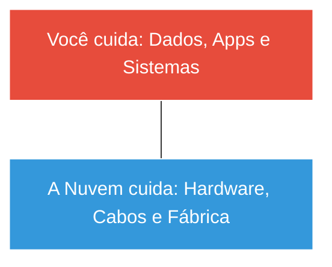

# ☁️ Cloud Computing: Master Class Edition

O céu não é o limite, é o seu novo data center. Aprenda a arquitetura, segurança e economia da computação em nuvem. Este guia transforma você em um arquiteto capaz de provisionar infraestruturas globais de alta disponibilidade.

---

## 📂 Módulo 1: A Fundação - Virtualização

Antes da nuvem, existe a virtualização. Sem ela, a nuvem não existiria.

### 1.1 Hypervisors: O Motor
- **Tipo 1 (Bare Metal):** Instalado direto no hardware. Máxima performance.
    - *Exemplos:* VMware ESXi, Microsoft Hyper-V, Xen.
- **Tipo 2 (Hosted):** Roda em cima do Windows/Linux. Bom para laboratórios.
    - *Exemplos:* VirtualBox, VMware Workstation.

---

## 🏗️ Módulo 2: Modelos de Serviço (O que você compra?)

Entender quem manda no quê é vital para o Modelo de Responsabilidade Compartilhada.

| Modelo | Nome | O que a Nuvem entrega? | Exemplo Real |
| :--- | :--- | :--- | :--- |
| **IaaS** | Infrastructure | O "Computador" (CPU/RAM/HD) | AWS EC2, Azure VM |
| **PaaS** | Platform | O ambiente para seu código rodar | Vercel, Heroku |
| **SaaS** | Software | A ferramenta pronta para uso | Gmail, Office 365 |
| **FaaS** | Serverless | Execução de uma única função | AWS Lambda |

---

## ⚙️ Módulo 3: Conceitos de Arquitetura de Elite

- **Escalabilidade Vertical (Up):** Aumentar a potência de uma única máquina (Mais RAM).
- **Escalabilidade Horizontal (Out):** Adicionar MAIS máquinas para dividir a carga. (Padrão Nuvem).
- **Auto Scaling:** Noite de Black Friday? A nuvem cria 10 servidores sozinha. De madrugada? Ela desliga tudo para você não pagar nada.

---

## 📦 Módulo 4: Containers e Modernização (Docker & K8s)

O futuro da nuvem não são máquinas virtuais inteiras, mas sim **Containers**.
- **Docker:** Empacota sua aplicação com tudo que ela precisa para rodar ("Se funciona na minha máquina, funciona na nuvem").
- **Kubernetes (K8s):** O maestro que gerencia milhares de containers ao mesmo tempo.

---

## 🔍 Módulo 5: Troubleshooting de Custos (FinOps)

::: info 🛡️ Na Trincheira: Caso Real
Uma startup estava gastando **R$ 20.000/mês** com servidores ligados 24h. Usei o conceito de **Instâncias Reservadas** (onde você paga adiantado por 1 ano) e o gasto caiu para **R$ 11.000**. **A nuvem é barata se você souber configurar.**
:::

### 5.1 Estratégias de Economia
1.  **Spot Instances:** Máquinas com 90% de desconto que a AWS pode "pedir de volta" a qualquer momento (Ideal para processamento pesado que não é urgente).
2.  **S3 Lifecycle:** Mova arquivos velhos que ninguém acessa para o "Glacier" (Onde o GB custa centavos).

---

### Links de Referência Master
- [🏢 Windows Server & AD](/guias/Curso_Windows_Server_AD) - Cloud Híbrida com Azure.
- [🐧 Domínio do Linux](/guias/Curso_Dominio_Linux) - O sistema que roda na nuvem.
- [💻 Desenvolvimento Web](/guias/Guia_Desenvolvimento_Web) - APIs escaláveis.
- [🗄️ Banco de Dados Avançado](/guias/Curso_Banco_Dados_Avancado) - Bancos de dados gerenciados (RDS).
