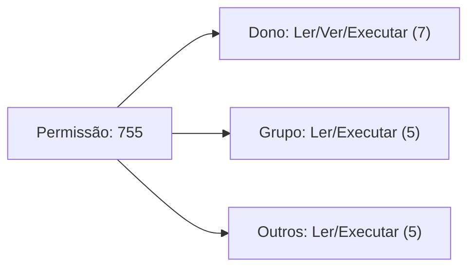

# 🐧 Domínio do Linux


Transforme-se em um mestre do terminal. O Linux não é apenas um sistema; é o superpoder de qualquer técnico de elite.

---

## 📂 Arquitetura do Sistema

Entenda para onde cada arquivo vai. No Linux, "Tudo é um arquivo".

```mermaid
graph TD
    Root["/ (Root)"] --> bin["/bin (Comandos Essenciais)"]
    Root --> etc["/etc (Arquivos de Configuração)"]
    Root --> home["/home (Pastas de Usuários)"]
    Root --> var["/var (Logs e Variáveis)"]
    Root --> tmp["/tmp (Temporários)"]
    
    style Root fill:#1a1a1a,stroke:#00ff00,stroke-width:2px
```



---

## 📚 Módulo 1: Comandos Salva-Vidas

### O Poder das Permissões (chmod)
Muitas vezes, um script não roda apenas porque falta permissão de execução.



::: tip 💡 Dica de Mestre
Decore este código: `chmod +x script.sh`. Ele transforma qualquer arquivo de texto em um programa executável instantaneamente.
:::

---

## 🔧 Módulo 2: Administração de Elite

### Gerenciamento de Serviços (Systemd)
O comando mais importante para um administrador de servidores:

| Comando | Função | Quando Usar |
| :--- | :--- | :--- |
| `systemctl status X` | Ver se está rodando | Primeiro passo do diagnóstico |
| `systemctl restart X` | Reiniciar serviço | Após mudar uma configuração |
| `systemctl enable X` | Ligar no boot | Garantir que o serviço volte após queda de luz |

::: warning ⚠️ Cuidado com o Root
O comando `rm -rf /` pode destruir todo o sistema em segundos. Sempre use o `ls` no caminho antes de usar o `rm` para ter certeza do que está apagando.
:::

---

## 🔍 Módulo 3: Troubleshooting de Monitoramento

::: info 🛡️ Na Trincheira: Caso Real
Um servidor parou de responder. Usei o comando `top` e vi que um processo estava usando **99% da CPU**. Identifiquei o **PID (8245)** e usei o `kill -9 8245` para liberar o sistema. O servidor voltou ao normal sem precisar reiniciar.
:::

---

## 🎯 Exercícios Práticos

::: details 🛠️ Laboratório: Criando seu primeiro Robô (Scripts)
1. Crie um arquivo: `nano monitor.sh`
2. Cole este código:
   ```bash
   #!/bin/bash
   echo "--- Status da Memória ---"
   free -h
   ```
3. Salve e saia (Ctrl+O, Ctrl+X).
4. Dê permissão: `chmod +x monitor.sh`
5. Rode seu robô: `./monitor.sh`
:::

---

### Links Relacionados
- [🌐 Curso de Redes](/guias/Curso_Redes_Computadores)
- [🛠️ Ferramentas Pen-drive](/guias/Curso_Ferramentas_Pendrive)
