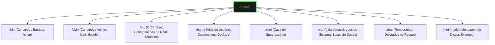

# 🐧 Domínio do Linux: Master Class Edition


Transforme-se em um mestre do terminal. O Linux não é apenas um sistema operacional; é a fundação da infraestrutura tecnológica mundial. No final deste guia, você terá o controle total do kernel.

---

## 📂 Módulo 1: O Esqueleto do Pinguim (Estrutura de Diretórios)

No Linux, **"Tudo é um arquivo"**. Entender onde cada engrenagem fica é vital para o troubleshooting.



---

## 🔐 Módulo 2: Permissões e Segurança de Arquivos

Muitas falhas em sistemas Linux ocorrem por permissões erradas. Dominar o `chmod` e o `chown` é obrigatório.

### 2.1 A Matriz das Permissões (Octal)
| Valor | Letra | Significado |
| :--- | :--- | :--- |
| **4** | `r` | Read (Leitura) |
| **2** | `w` | Write (Escrita) |
| **1** | `x` | Execute (Execução) |

**Cálculo:** `777` = Tudo liberado (4+2+1 para Dono, Grupo e Outros).
**Padrão Seguro:** `644` (Dono escreve, outros só leem) ou `755` (Dono faz tudo, outros leem e executam).

### 2.2 Permissões Especiais (O Perigo)
- **SUID (Set User ID):** Faz um arquivo rodar com as permissões do Dono (ex: o `passwd` tem SUID para poder mexer no arquivo de senhas do sistema).
- **SGID:** O arquivo roda com permissões do grupo.
- **Sticky Bit:** Apenas o dono pode deletar um arquivo dentro de uma pasta (usado no `/tmp`).

---

## 📦 Módulo 3: Gestão de Pacotes e Repositórios

Linux é sobre saber onde buscar o seu software com segurança.

### 3.1 O Ecossistema APT (Debian/Ubuntu/Kali)
| Comando | O que faz? |
| :--- | :--- |
| `sudo apt update` | Baixa a lista de versões novas dos programas. |
| `sudo apt upgrade` | Instala as atualizações de fato. |
| `sudo apt install [nome]` | Instala um software novo. |
| `apt search [termo]` | Procura se existe um programa nos repositórios. |

::: tip 💡 Dica de Elite: Limpeza
Use `sudo apt autoremove` e `sudo apt autoclean` regularmente para remover dependências antigas e lixo que sobra de instalações passadas.
:::

---

## 🔬 Módulo 4: Diagnóstico e Monitoramento de Processos

### 4.1 "O Médico de Plantão"
| Comando | O que revela? |
| :--- | :--- |
| `htop` | Versão visual e interativa dos processos (Memória, CPU, Cores). |
| `journalctl -xe` | Mostra os logs mais recentes de erro do sistema (Salvador de vidas). |
| `dmesg -T` | Mostra mensagens do Kernel (Hardware, USB conectada). |
| `lsof -i :80` | Mostra qual programa está "sentado" na porta 80. |

::: info 🛡️ Caso Real: O Processo Fantasma
Um site parou de carregar. O Apache parecia ligado, mas o `status` dava erro de porta. Usei o `lsof -i :80` e vi que o Skype tinha subido antes do Apache e "roubado" a porta 80. Matei o Skype, reiniciei o Apache e tudo voltou. **Diagnóstico rápido salva a paz do administrador.**
:::

---

## 🤖 Módulo 5: Automação com Bash Scripting (O Robô)

Um mestre nunca faz a mesma coisa duas vezes manualmente.

### 5.1 O Tridente de Ouro: Grep, Sed e Awk
- **Grep:** Busca texto em arquivos. `grep "ERROR" /var/log/syslog`
- **Sed:** Substitui texto na hora. `sed -i 's/antigo/novo/g' arquivo.txt`
- **Awk:** Manipula colunas. `ls -l | awk '{print $9}'` (mostra só os nomes dos arquivos).

### 5.2 Estrutura de Loop (Exemplo: Backup)
```bash
#!/bin/bash
# Backup simples de todos os sites
for site in /var/www/html/*; do
    tar -czf backup_$(basename $site).tar.gz $site
    echo "Backup de $site COMPLETO!"
done
```

---

### Links de Referência Master
- [🌐 Redes de Computadores](/guias/Curso_Redes_Computadores) - Configure SSH e Firewalls.
- [🐍 Python para Automação](/guias/Curso_Python_Automacao) - Leve seus scripts para o próximo nível.
- [🛠️ Ferramentas Pen-drive](/guias/Curso_Ferramentas_Pendrive) - Linux portáteis.
