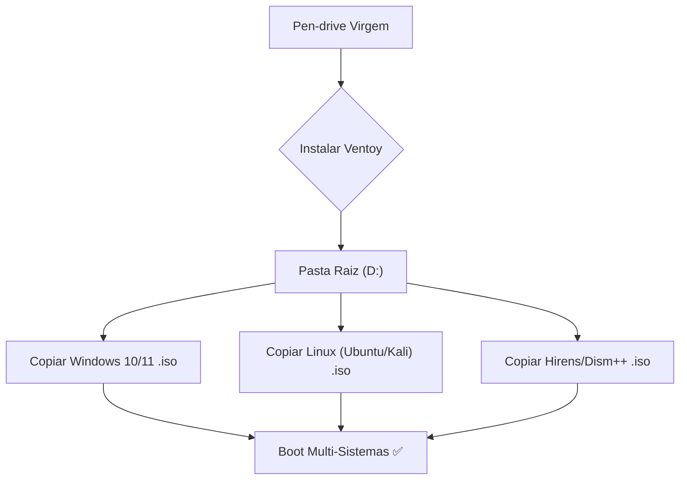

# 🛠️ Ferramentas do Pen-drive

Este guia transforma seu pen-drive em uma arma de diagnóstico de elite. Aprenda a usar profissionalmente cada ferramenta para resolver problemas em tempo recorde.

---

## 📂 Fluxo de Trabalho Multi-boot

O coração do seu pen-drive é o **Ventoy**. Ele permite que você simplesmente arraste e solte ISOs para o disco e elas apareçam no menu de boot automaticamente.

---

## 🛠️ Categoria 01: Sistemas e ISOs

### Ventoy (O Rei do Multi-boot)
**O que é:** Transforma seu pen-drive em um repositório dinâmico de sistemas operacionais.

::: tip 💡 Dica do Matheus
Mantenha uma pasta chamada `ISOs` dentro do pen-drive para organizar por categorias (Windows, Linux, Diagnostic). O Ventoy vasculha todas as pastas automaticamente!
:::

**Como usar:**
1. Execute `Ventoy2Disk.exe`.
2. Selecione seu pen-drive e clique em **Install**.
3. Copie as ISOs para a raiz. Pronto.

---

## 🔍 Categoria 02: Diagnóstico de Hardware

### CrystalDiskInfo (O Raio-X do HD)
**O que é:** A primeira ferramenta que você deve abrir em QUALQUER atendimento.

::: danger ⚠️ Alerta Crítico
Se o status aparecer como **"Cuidado" (Amarelo)** ou **"Crítico" (Vermelho)**, pare tudo! Faça o backup dos dados do cliente IMEDIATAMENTE antes de tentar qualquer reparo.
:::

| Status | Cor | Ação Recomendada |
| :--- | :--- | :--- |
| **Bom** | Azul | Disco saudável, pode prosseguir. |
| **Atenção** | Amarelo | Backup imediato. Possível falha em breve. |
| **Crítico** | Vermelho | Troque o disco. Risco iminente de perda total. |

---

## 🔧 Categoria 03: Manutenção de Sistema

### Dism++ (A Canivete Suíço)
**O que é:** Ferramenta indispensável para otimizar Windows e limpar gigabytes de lixo.

::: info 🛡️ Na Trincheira: Caso Real
Um cliente reclamou de "Disco C Cheio" mesmo sem arquivos. Usei o **Dism++ > Limpeza de Disco > Windows Update Cleanup**. Recuperei **15GB** de espaço removendo sobras de atualizações antigas que o Windows padrão não apaga.
:::

### SDI (Drivers Offline)
**O que é:** Salvação para PCs sem internet pós-formatação.

::: warning ⚡ Atenção
Sempre marque **apenas** os drivers que faltam ("Not Installed"). Atualizar drivers que já funcionam pode causar instabilidade em PCs antigos.
:::

---

## 💾 Categoria 04: Recuperação de Dados

### MiniTool Power Data Recovery
**O que é:** Recupera arquivos deletados ou de discos formatados.

::: tip 🔍 Segredo Profissional
Se o cliente deletou um arquivo, **NÃO INSTALE NADA** no disco dele. Rode o MiniTool direto do seu Pen-drive (versão portátil) para não sobrescrever os dados que você quer salvar.
:::

---

## 📝 Procedimento Padrão (SOP)

Siga este checklist em todo atendimento para garantir qualidade de elite:

::: details 📋 Checklist do Técnico Profissional (Clique para expandir)
1. [ ] **Anamnese:** Pergunte ao cliente EXATAMENTE quando o problema começou.
2. [ ] **Saúde do Disco:** CrystalDiskInfo antes de qualquer instalação.
3. [ ] **Temperaturas:** HWiNFO64 para checar superaquecimento.
4. [ ] **Backup:** NUNCA formate sem confirmar o backup duas vezes.
5. [ ] **Relatório:** Documente o que foi feito no arquivo `status_manutencao.md`.
:::

---

### Links Relacionados
- [🎓 Planejamento de Estudos](/estudos/Roadmap_Estudos)
- [🖥️ Curso de Montagem PC](/guias/Curso_Montagem_Manutencao_PC)
