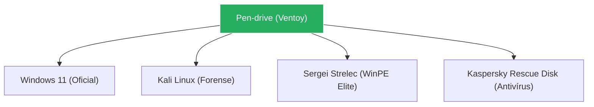

# 🛠️ Ferramentas do Pen-drive: Master Class Edition

Este guia transforma o seu simples pen-drive em uma arma de diagnóstico e resgate de elite. Aprenda a usar profissionalmente as ferramentas que salvam sistemas condenados e recuperam dados considerados perdidos. No mundo da TI, seu pen-drive é o seu kit de primeiros socorros.

---

## 📂 Módulo 1: O Núcleo Multi-boot (Ventoy Avançado)

O **Ventoy** é a base. Ele permite que você arraste ISOs para o pen-drive e dê boot nelas sem precisar formatar a cada novo sistema.

### 1.1 Configuração de Elite
- **Persistence (Persistência):** Crie um arquivo de persistência para o Ubuntu/Kali. Assim, as configurações e arquivos que você salvar dentro do Linux no pen-drive **não sumirão** ao desligar.
- **Estrutura de Pastas:** Organize por `/Sistemas`, `/Diagnostico`, `/Recovery`. O Ventoy organiza o menu automaticamente.

---

## 🏗️ Módulo 2: Ambientes de Resgate (WinPE)

Quando o Windows do cliente não sobe, você entra com um "Sistema Paralelo".

### 2.1 Sergei Strelec vs Hiren's BootCD
- **Hiren's BootCD PE:** Versão clássica e estável, baseada em Windows 10.
- **Sergei Strelec (Recomendado):** O canivete suíço definitivo. Contém centenas de ferramentas de rede, discos, senhas e drivers já pré-instalados.

---

## 🔎 Módulo 3: Diagnóstico e Manutenção de Discos

### 3.1 Victoria (O Mapeador de Bad Blocks)
Diferente do CrystalDiskInfo (que só lê a saúde), o **Victoria** testa cada setor do disco.
- **Remap:** Se achar um setor lento (verde/laranja), ele pode tentar "esconder" esse setor para o Windows não travar mais.

### 3.2 MiniTool Partition Wizard
O mestre das partições.
- **Uso:** Aumentar o drive C: pegando espaço do D:, converter MBR para GPT sem formatar, e clonar HD para SSD.

---

## 🔐 Módulo 4: Senhas e Segurança

### 4.1 bypass de Senha do Windows (NTPWEdit / Lazesoft)
O cliente esqueceu a senha e não quer formatar?
1. Dê boot pelo Pen-drive (WinPE).
2. Abra o **NTPWEdit**.
3. Aponte para o arquivo `SAM` do Windows do cliente.
4. Clique em **Unlock** ou **Change Password**.
5. Reinicie e entre sem senha.

### 4.2 Kaspersky Rescue Disk
Se o antivírus dentro do Windows não consegue pegar o vírus (porque o vírus se "esconde" enquanto o sistema roda), o Rescue Disk mata o vírus **por fora**, com o Windows desligado.

---

## 💾 Módulo 5: Recuperação de Dados Forense

### 5.1 TestDisk & PhotoRec
- **TestDisk:** Recupera partições inteiras que sumiram (quando o disco vira "RAW").
- **PhotoRec:** Ignora o sistema de arquivos e busca a "assinatura" dos arquivos direto nos clusters. Recupera fotos mesmo de discos onde a tabela de partição foi destruída.

::: info 🛡️ Caso Real: O Pen-drive da Formatura
Uma cliente formatou o cartão SD da câmera por engano. O Windows dizia "Disco precisa ser formatado". Usei o **PhotoRec** via Pen-drive de suporte e recuperei **1.200 fotos** de formatura. **A cliente chorou de emoção. Esse é o poder de um técnico de elite.**
:::

---

## 📝 Módulo 6: O Ritual de Sobrevivência (Checklist)

::: details 📋 O que ter no seu Pen-drive HOJE: (Clique para expandir)
Siga este setup para estar pronto para 99% dos problemas:
1. [ ] **Ventoy** instalado (GPT/Secure Boot support ON).
2. [ ] **Windows 10 e 11** (ISOs oficiais da Microsoft).
3. [ ] **Sergei Strelec WinPE** (O kit mais completo).
4. [ ] **Dism++** (Para limpeza e backup de drivers).
5. [ ] **CrystalDiskInfo** (Para diagnóstico inicial).
6. [ ] **Kaspersky Rescue Disk** (Para desinfecção).
:::

---

### Links de Referência Master
- [🖥️ Montagem e Manutenção](/guias/Curso_Montagem_Manutencao_PC) - Teoria dos componentes.
- [🔍 Troubleshooting Profissional](/guias/Guia_Troubleshooting_Profissional) - Como usar essas ferramentas com lógica.
- [🐧 Domínio do Linux](/guias/Curso_Dominio_Linux) - Use o terminal no pen-drive.
- [🏢 Windows Server & AD](/guias/Curso_Windows_Server_AD) - Resgate de servidores.
