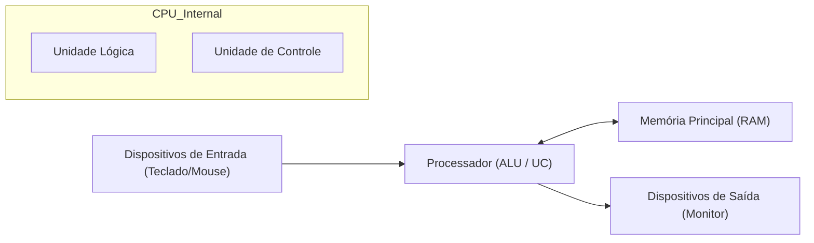

# 🧮 Curso: Fundamentos de Ciência da Computação

*(Banner em processamento - Ciência e Teoria)*

A teoria que separa o programador do cientista. Entenda como os bits se tornam softwares complexos e como a faculdade enxerga o mundo digital.

---

## 📂 Arquitetura da Máquina (Von Neumann)

Tudo o que você usa, do celular ao servidor, segue este fluxo básico de processamento e memória.

---

## 🧠 Módulo 1: Lógica e Portas Lógicas

Os computadores "pensam" apenas com **Sim** ou **Não**. O segredo está em como combinamos esses valores.

| Operação | Símbolo | Resultado (1=True, 0=False) |
| :--- | :--- | :--- |
| **AND (E)** | `&` | 1 se todos forem 1 |
| **OR (OU)** | `\|` | 1 se pelo menos um for 1 |
| **NOT (NÃO)** | `!` | Inverte o valor (0 vira 1) |
| **XOR** | `^` | 1 se forem diferentes entre si |

::: tip 💡 Dica do Matheus
Quando estiver estudando para a faculdade, lembre-se: a **Álgebra de Boole** é o que faz o seu `if` no código funcionar. Se você domina a tabela verdade aqui, nunca mais erra uma condição lógica complexa!
:::

---

## 🖥️ Módulo 2: O Sistema Operacional

O SO é o mestre de obras que gerencia os recursos.

::: info 🛡️ Na Trincheira: Caso Real
Um programa estava travando o PC inteiro. No **Gerenciador de Tarefas**, vi que ele estava criando centenas de **Threads** mas não fechava nenhuma. Isso esgotou a memória do sistema. **Lição:** Entender como o SO gerencia processos impede que você crie softwares que agem como "vampiros" de memória.
:::

---

## 📝 Procedimento Profissional: Criptografia e Segurança

::: details 🔐 Checklist: Fundamentos de Segurança (Clique para expandir)
Siga estes princípios teóricos no desenvolvimento:
1. [ ] **Hashing:** NUNCA salve senhas em texto puro. Use SHA-256.
2. [ ] **Princípio do Menor Privilégio:** Dê apenas o acesso necessário ao usuário.
3. [ ] **Criptografia Assimétrica:** Use chaves públicas para comunicação segura (HTTPS/SSH).
:::

---

### Links Relacionados
- [📊 Algoritmos e Estruturas de Dados](/guias/Curso_Algoritmos_Estruturas_Dados)
- [🐧 Domínio do Linux](/guias/Curso_Dominio_Linux)
- [🖥️ Montagem e Manutenção](/guias/Curso_Montagem_Manutencao_PC)
