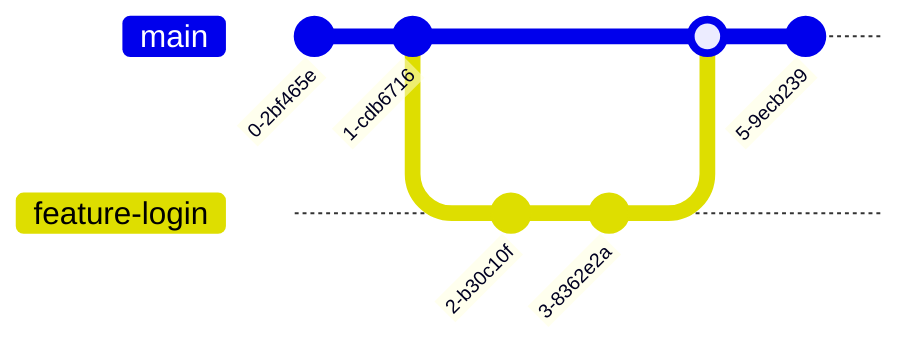

# 🔀 Git e GitHub Profissional


A máquina do tempo do desenvolvedor. Aprenda a controlar versões, colaborar em equipe e manter seu código seguro contra desastres.

---

## 📂 O Fluxo de Trabalho do Git

Como seus arquivos viajam do computador para o servidor?


---

## 🛠️ Módulo 1: Comandos do Dia a Dia

### Iniciando a Jornada
```bash
git init                # Começa um novo projeto
git add .               # Adiciona tudo ao "carrinho" (Staging Area)
git commit -m "Mensagem" # Salva as mudanças no seu histórico
git push origin main    # Envia tudo para a nuvem
```

::: tip 💡 Dica do Matheus
Nunca faça um `git push` sem antes fazer um `git status`. Isso evita que você envie arquivos temporários ou configurações pessoais por engano para o servidor!
:::

---

## 🔀 Módulo 2: Branches e Colaboração

### Trabalhando em Equipe
Branches permitem que você mexa no código sem quebrar a versão principal que está online.



::: info 🛡️ Na Trincheira: Caso Real
Fui contratado para corrigir um bug urgente, mas eu estava no meio de uma funcionalidade nova. Se eu continuasse na mesma branch, enviaria código incompleto. **Solução:** Criei uma branch `fix-bug`, corrigi, dei o push e depois voltei para a minha `feature-nova`. O site não parou e meu trabalho continuou salvo.
:::

---

## 📝 Procedimento Profissional: O arquivo .gitignore

::: details 🚫 O que NÃO enviar para o GitHub (Clique para expandir)
Sempre configure seu `.gitignore` para ignorar:
1. [ ] `node_modules/` (Milhares de arquivos pesados)
2. [ ] `.env` (Suas senhas e chaves secretas)
3. [ ] `dist/` ou `build/` (Arquivos gerados automaticamente)
4. [ ] `*.log` (Arquivos de log gigantes)
:::

---

### Links Relacionados
- [💻 Desenvolvimento Web](/guias/Guia_Desenvolvimento_Web)
- [🗄️ Bancos de Dados Avançados](/guias/Curso_Banco_Dados_Avancado)
