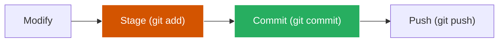
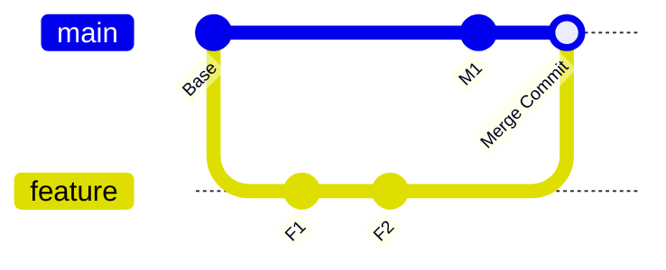

# 🔀 Git e GitHub Profissional: Master Class Edition

A máquina do tempo do desenvolvedor. Aprenda a controlar versões, colaborar em equipes multinacionais e manter seu código seguro contra desastres. Este guia transforma você de um amador que dá `git add .` em um arquiteto de fluxos de trabalho distribuídos.

---

## 📂 Módulo 1: A Anatomia do Git (O que acontece por baixo?)

O Git não guarda "mudanças", ele guarda **Snapshots** (Fotos).

### 1.1 Os Estados do Arquivo
1.  **Working Directory:** Onde você edita o código. (Unstaged).
2.  **Staging Area:** O "Carrinho de Compras". Você escolhe o que vai para o commit.
3.  **Local Repo:** A versão salva no seu PC.
4.  **Remote Repo:** A versão salva no GitHub.

---

## 🛠️ Módulo 2: Maestria no Terminal (Comandos de Elite)

### 2.1 Salvando o Trabalho Temporário (`git stash`)
Você está no meio de um código, mas precisa mudar de branch urgente para corrigir um bug.
- `git stash`: "Esconde" suas mudanças atuais.
- `git checkout main`: Muda de branch.
- `git stash pop`: Recupera seu trabalho de volta após o susto.

### 2.2 O Resgatista (`git reflog`)
"Deletei a branch errada e perdi tudo!". O `reflog` guarda o histórico de **todos** os movimentos de cabeçalho do seu PC. Você pode voltar no tempo mesmo se tiver deletado uma branch ou feito um rebase errado.

---

## 🔀 Módulo 3: Fluxos de Trabalho (Merge vs Rebase)

### 3.1 O Grande Dilema
- **Merge:** Cria um "commit de mesclagem". Preserva a história real (incluindo as idas e vindas).
- **Rebase:** "Reescreve" a história para parecer que tudo foi feito em linha reta. Deixa o gráfico do GitHub lindo, mas deve ser usado com cuidado em branches compartilhadas.

---

## 🆘 Módulo 4: Resolvendo Conflitos de Código

Conflitos acontecem quando duas pessoas mexem na **mesma linha** do mesmo arquivo.
1. O Git bloqueia o Merge.
2. Você abre o arquivo e verá as marcações `<<<< HEAD` e `>>>> [branch]`.
3. Você escolhe qual versão fica (ou as duas), salva e faz um novo commit.

::: tip 💡 Dica de Mestre
Para evitar conflitos gigantes, faça `git pull` todas as manhãs antes de começar a trabalhar. Pequenos conflitos são fáceis; conflitos de uma semana de trabalho são pesadelos.
:::

---

## 🚀 Módulo 5: GitHub Profissional (Actions & Pull Requests)

### 5.1 O Pull Request (PR) de Elite
Não é apenas um botão. É um processo de qualidade:
- **Code Review:** Outro desenvolvedor olha seu código antes de entrar no sistema principal.
- **GitHub Actions:** Robôs que rodam seus testes automaticamente. Se o código quebrar, o robô bloqueia o Merge.

### 5.2 Segurança de Chaves
NUNCA envie senhas no código. Use variáveis de ambiente e segredos no GitHub (Settings > Secrets).

---

## 🧪 Módulo 6: O Caso do Commit Errado

::: info 🛡️ Na Trincheira: Caso Real
Um colega fez um commit com a senha do banco de dados e deu o push pro GitHub público. Deletar o arquivo e dar push de novo **não resolve**, pois a senha continua no histórico! **Solução:** Tivemos que usar o **BFG Repo-Cleaner** para varrer o histórico inteiro e remover todas as menções àquela senha antes que um bot a capturasse. **Cuidado com o que você commita!**
:::

---

### Links de Referência Master
- [💻 Desenvolvimento Web](/guias/Guia_Desenvolvimento_Web) - Use Git para seus deploys na Vercel.
- [🐧 Domínio do Linux](/guias/Curso_Dominio_Linux) - Git no servidor via SSH.
- [🐍 Python para Automação](/guias/Curso_Python_Automacao) - Versionando seus scripts de robôs.
- [📊 Algoritmos e Estruturas de Dados](/guias/Curso_Algoritmos_Estruturas_Dados) - Entenda a estrutura de grafos do Git.
