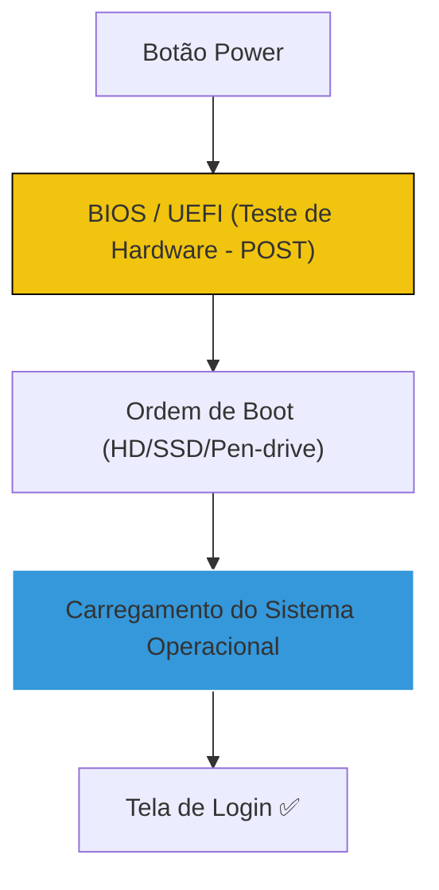

# 🖥️ Curso: Montagem e Manutenção de PCs

Domine o hardware. Da escolha dos componentes ao diagnóstico de falhas físicas, este guia transforma você em um cirurgião de computadores.

---

## 📂 O Fluxo de Inicialização (Boot)

O que acontece quando você aperta o botão de ligar?

---

## 🛠️ Módulo 1: Diagnóstico de Falhas (SOP)

### O PC ligou mas não dá imagem?
1. **Beeps:** Escute os bips da placa-mãe (se houver speaker).
2. **Memória:** Tire os pentes de RAM, limpe com borracha e teste um por um.
3. **Energia:** Verifique se as tensões da fonte estão corretas com um multímetro.

::: tip 💡 Dica do Matheus
Muitos problemas de "PC não liga" são resolvidos apenas resetando a **BIOS** (tirando a bateria da placa-mãe por 30 segundos). Sempre tente isso antes de condenar um componente caro!
:::

---

## 🔧 Módulo 2: Refrigeração e Limpeza

::: danger ⚠️ Alerta Crítico
NUNCA use secador de cabelo quente para limpar o PC. O calor pode derreter componentes plásticos e a eletricidade estática pode queimar a placa. Use ar comprimido frio ou um pincel antiestático.
:::

| Componente | Temperatura Ideal (IDLE) | Temperatura Máxima (Carga) |
| :--- | :--- | :--- |
| **CPU (Processador)** | 35°C - 45°C | 85°C |
| **GPU (Placa de Vídeo)** | 40°C - 50°C | 80°C |
| **SSD / HD** | 30°C - 40°C | 55°C |

---

## 🔍 Módulo 3: Troubleshooting de Hardware

::: info 🛡️ Na Trincheira: Caso Real
Um PC desligava sozinho após 10 minutos de jogo. Usei o **HWiNFO64** e vi que o processador batia **100°C**. **Diagnóstico:** Pasta térmica ressecada e cooler mal encaixado. **Solução:** Limpeza e aplicação de pasta térmica de prata. O PC baixou para 65°C e não desligou mais.
:::

---

## 📝 Procedimento Profissional: Montagem Segura

::: details 🏗️ Checklist de Montagem (Clique para expandir)
Siga este roteiro para não queimar nada:
1. [ ] **Eletricidade Estática:** Toque em algo metálico aterrado antes de mexer.
2. [ ] **Processador:** Cuidado extremo com os pinos (não force!).
3. [ ] **Cabos:** Organize os cabos com abraçadeiras para melhorar o fluxo de ar.
4. [ ] **Drivers:** Após montar, instale os drivers de Chipset direto do site do fabricante.
:::

---

### Links Relacionados
- [🏢 Windows Server & AD](/guias/Curso_Windows_Server_AD)
- [🛠️ Ferramentas Pen-drive](/guias/Curso_Ferramentas_Pendrive)
