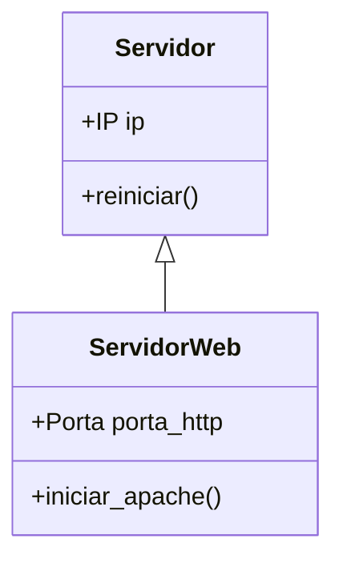

# 🎨 Programação Orientada a Objetos: Master Class Edition


Não apenas escreva código, desenhe sistemas. A POO é a arte de organizar a complexidade através de objetos que conversam entre si. Este é o diferencial entre um programador júnior e um arquiteto de software.

---

## 📂 Módulo 1: A Gênese (Classes e Objetos)

### 1.1 O Conceito do "Molde"
- **Classe:** É o projeto (blueprint). Ex: O "Projeto de um Carro".
- **Objeto:** É a instância real. Ex: "O seu Corolla PRATA de placa ABC-123".

### 1.2 O Construtor (`__init__`)
O método que dá vida ao objeto e define suas características iniciais (Atributos).
```python
class Usuario:
    def __init__(self, nome, nivel):
        self.nome = nome
        self.nivel = nivel
```

---

## 🏛️ Módulo 2: Os 4 Pilares Sagrados

### 2.1 Abstração (Expor apenas o necessário)
Você não precisa saber como o motor de ignição funciona para girar a chave.
```python
class ControleRemoto:
    def ligar_tv(self):
        # Esconde toda a lógica complexa de sinal IR
        print("Sinal enviado... TV Ligada!")
```

### 2.2 Encapsulamento (Proteção de Dados)
Protegemos atributos sensíveis usando `__` (double underscore) para evitar que sejam alterados por erro.
```python
class ContaBancaria:
    def __init__(self, saldo_inicial):
        self.__saldo = saldo_inicial # Atributo PRIVADO

    def depositar(self, valor):
        if valor > 0:
            self.__saldo += valor
```

### 2.3 Herança (Reutilização Genética)
Uma classe filha herda os métodos e atributos da classe pai, mas pode adicionar os seus próprios.


### 2.4 Polimorfismo (Múltiplas Formas)
Um mesmo método (ex: `conectar()`) age de forma diferente dependendo do objeto.
- **Banco de Dados:** Faz login via porta 3306.
- **SSH:** Faz login via chave criptográfica na porta 22.

---

## 🏗️ Módulo 3: Padrões de Projeto (Design Patterns)

### 3.1 Singleton (O Único)
Garante que uma classe tenha apenas **UMA** instância em todo o programa.
- **Uso:** Gerenciamento de Logs, Conexão com Banco de Dados.

### 3.2 Factory (A Fábrica)
Cria objetos sem que o programa precise saber a classe exata.
- **Uso:** Um sistema que gera relatórios em PDF, CSV ou Excel dependendo do clique do usuário.

---

## 🛡️ Módulo 4: O Guia SOLID de Sobrevivência

Não basta ser POO, tem que ser Limpo. O SOLID é o padrão ouro da indústria:

| Letra | Princípio | Explicação Simples |
| :--- | :--- | :--- |
| **S** | Single Responsibility | Uma classe deve ter apenas **UM** motivo para existir. |
| **O** | Open/Closed | O código deve ser aberto para extensão, mas fechado para modificação. |
| **L** | Liskov Substitution | Uma classe filha deve poder substituir a pai sem quebrar o sistema. |
| **I** | Interface Segregation | Não force uma classe a implementar métodos que ela não usa. |
| **D** | Dependency Inversion | Dependa de abstrações, não de implementações concretas (use interfaces). |

---

## 🧪 Módulo 5: Projeto Prático - Gerenciador de Lab

::: details 🛠️ Laboratório: Arquitetura de Servidores (Clique para expandir)
```python
class Dispositivo:
    def __init__(self, nome):
        self.nome = nome
    
    def status(self):
        return f"{self.nome}: Ativo"

class Roteador(Dispositivo):
    def status(self):
        return f"Roteador {self.nome}: Roteando pacotes..."

class Servidor(Dispositivo):
    def status(self):
        return f"Servidor {self.nome}: Processando requisições..."

# Polimorfismo em ação
meu_lab = [Roteador("Cisco"), Servidor("Dell R740")]
for item in meu_lab:
    print(item.status())
```
:::

---

### Links de Referência Master
- [📊 Algoritmos e Estruturas de Dados](/guias/Curso_Algoritmos_Estruturas_Dados) - Lógica avançada.
- [🐍 Python para Automação](/guias/Curso_Python_Automacao) - Scripts práticos.
- [💻 Desenvolvimento Web](/guias/Guia_Desenvolvimento_Web) - Use classes para gerenciar sites.
- [🗄️ Banco de Dados Avançado](/guias/Curso_Banco_Dados_Avancado) - Persistência de objetos.
