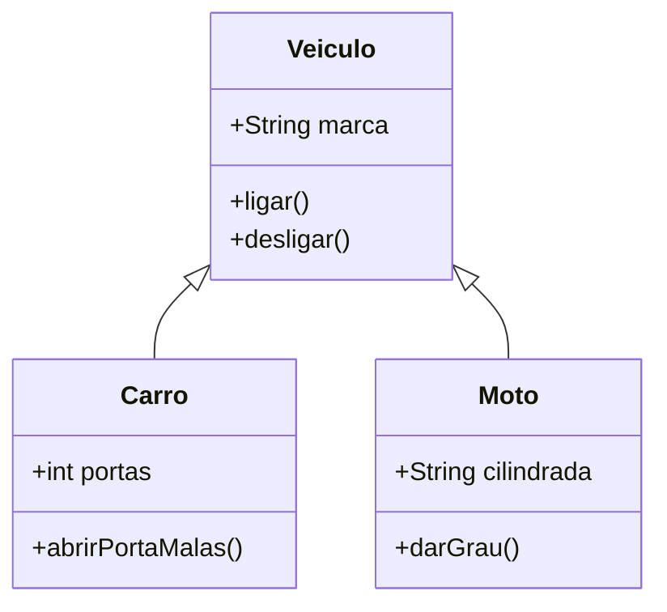

# 🎨 Curso: Programação Orientada a Objetos (POO)

*(Banner em processamento - Design e Modelagem)*

Não apenas escreva código, desenhe sistemas. A POO é a arte de organizar a complexidade através de objetos que conversam entre si.

---

## 🧬 A Árvore da Herança

Por que escrever o mesmo código duas vezes? Use a herança para criar especializações de um "molde" principal.

::: tip 💡 Dica do Matheus
O segredo da POO não é criar classes gigantescas, mas sim classes pequenas que fazem apenas **uma coisa** muito bem. Isso se chama **Princípio da Responsabilidade Única (SOLID)**.
:::

---

## 🔒 Os 4 Pilares do Mestre

| Pilar | O que é? | Analogia |
| :--- | :--- | :--- |
| **Abstração** | Esconder o complexo | Você dirige o carro sem saber como a explosão do motor funciona |
| **Encapsulamento** | Proteger os dados | Os fios do seu PC estão dentro de uma caixa para ninguém puxar por erro |
| **Herança** | Reutilizar código | Você herdou o DNA dos seus pais, mas tem suas próprias habilidades |
| **Polimorfismo** | Mudar o comportamento | O botão "Play" funciona no Spotify e no YouTube, mas fazem coisas diferentes |

---

## 🏗️ Design Patterns (Padrões de Projeto)

::: info 🛡️ Na Trincheira: Caso Real
Eu precisava que o sistema de banco de dados fosse acessado por várias partes do código ao mesmo tempo, mas sem criar 50 conexões diferentes. Usei o padrão **Singleton**. Isso garantiu que existisse apenas **UMA** conexão global, economizando memória e evitando erros de sincronização.
:::

---

## 📝 Procedimento Profissional: SOLID

::: details 🏗️ Checklist: O código está bem desenhado? (Clique para expandir)
Siga os 5 mandamentos do SOLID:
1. [ ] **S:** Cada classe tem apenas um motivo para mudar?
2. [ ] **O:** Você consegue adicionar funções sem alterar o código antigo?
3. [ ] **L:** Uma subclasse pode substituir a classe pai sem quebrar nada?
4. [ ] **I:** Suas interfaces são específicas para quem as usa?
5. [ ] **D:** Você depende de abstrações (interfaces) e não de classes concretas?
:::

---

### Links Relacionados
- [📊 Algoritmos e Estruturas de Dados](/guias/Curso_Algoritmos_Estruturas_Dados)
- [🐍 Python para Automação](/guias/Curso_Python_Automacao)
- [💻 Desenvolvimento Web](/guias/Guia_Desenvolvimento_Web)
