# 🛡️ Kali Linux - Do Zero ao Elite (Mastery)

Bem-vindo ao quartel-general da segurança ofensiva. Este guia não ensina apenas a usar ferramentas; ele ensina a mentalidade de um Pentester Profissional.

---

## 📂 Metodologia de Ataque (PTES)

Um hacker amador sai atirando para todo lado. Um profissional segue um processo cirúrgico.

```mermaid
graph TD
    A["1. Reconhecimento (Gathering)"] --> B["2. Varreduração (Scanning/Nmap)"]
    B --> C["3. Análise de Vagas (Vulnerabilidades)"]
    C --> D["4. Exploração (Ganhando Acesso)"]
    D --> E["5. Pós-Exploração (Mantendo Acesso)"]
    E --> F["6. Relatório Final (Documentação) ✅"]
    
    style A fill:#1a1a1a,stroke:#ff0000,stroke-width:2px
    style D fill:#a93226,stroke:#fff,stroke-width:3px
```

---

## 🛠️ Módulo 1: O Arsenal de Reconhecimento

### Nmap: O Mapa da Mina
A ferramenta mais importante do seu cinto de utilidades.

::: tip 💡 Dica do Matheus
Nunca use o Nmap sem salvar o resultado em um arquivo. Use a flag `-oN`:
`nmap -sV -p- 192.168.1.5 -oN scan_completo.txt`
Assim, você pode conferir as portas depois sem precisar rodar o scan de novo (o que economiza tempo e evita detecção).
:::

| Comando | O que faz? | Quando usar? |
| :--- | :--- | :--- |
| `nmap -sn [REDE]` | Ping Sweep | Descobrir quem está ligado na rede rápido |
| `nmap -A [IP]` | Scan Agressivo | Descobrir SO, Versão e rodar scripts básicos |
| `nmap --script vuln [IP]` | Scan de Vuln | Tenta achar falhas conhecidas automaticamente |

---

## 🕷️ Módulo 2: O Momento do Ataque (Exploitation)

### Metasploit Framework
Quando o reconhecimento acaba e a invasão começa.

::: danger ⚠️ Alerta de Segurança
NUNCA rode exploits em redes que você não tem permissão por escrito. No terminal do Kali, o comando `msfconsole` é a porta de entrada para um arsenal de guerra digital. Use com responsabilidade.
:::

**Workflow de Exploração:**
1. `search [nome_do_servico]` (Ex: BlueKeep, SMB)
2. `use [numero_do_exploit]`
3. `set RHOSTS [IP_DO_ALVO]`
4. `exploit` (O momento da verdade)

---

## 🕵️ Módulo 3: Sniffing e Engenharia Social

::: info 🛡️ Na Trincheira: Caso Real
Fui testar a rede de uma empresa e descobri que o sistema de ponto deles rodava em **HTTP** (sem o S). Usei o **Wireshark** para "ouvir" o tráfego e capturei o login e a senha do gerente em texto puro. **Lição:** Se não tiver cadeado verde no navegador, seus dados estão voando pelo ar para qualquer um pegar!
:::

---

## 📝 Procedimento Padrão do Hacker Ético

::: details 🛡️ Checklist: Missão de Elite (Clique para expandir)
Antes de começar qualquer teste, verifique:
1. [ ] **VPN Ativa:** Sua identidade está mascarada?
2. [ ] **Logs:** O comando `script log_sessao.txt` está rodando para gravar seus passos?
3. [ ] **Backups:** Você confirmou que o alvo tem backup caso o exploit trave o sistema?
4. [ ] **Wordlists:** Sua `rockyou.txt` está atualizada para o john/hydra?
:::

---

### Links Relacionados
- [🐧 Domínio do Linux](/guias/Curso_Dominio_Linux)
- [🌐 Redes de Computadores](/guias/Curso_Redes_Computadores)
- [🔍 Troubleshooting Profissional](/guias/Guia_Troubleshooting_Profissional)
