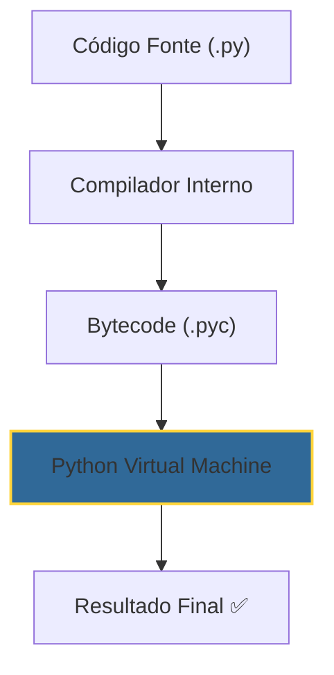

# 🐍 Python para Automação de TI


Aprenda a criar robôs que trabalham por você. Do básico à automação avançada de processos técnicos.

---

## 📂 Lógica de Execução Python

Como o Python interpreta seu código? Entenda o fluxo para evitar erros de sintaxe.



---

## 🛠️ Módulo 1: Scripts que Resolvem Problemas

### Verificação de Saúde (Ping em Massa)
Automatize o monitoramento da sua rede com poucas linhas.

::: tip 💡 Dica do Matheus
Sempre use blocos `try/except` ao lidar com redes ou arquivos. Isso evita que seu script "morra" se um servidor estiver offline ou um arquivo estiver bloqueado.
:::

```python
import os

def check_network(ips):
    for ip in ips:
        # 'nul' no Windows esconde a saída suja do comando
        response = os.system(f"ping -n 1 {ip} > nul") 
        status = "✅ ONLINE" if response == 0 else "❌ OFFLINE"
        print(f"{ip}: {status}")

check_network(["8.8.8.8", "192.168.1.1"])
```

---

## 🔧 Módulo 2: Automação de Arquivos

### Otimizador de Downloads
Mantenha sua pasta de trabalho sempre limpa com inteligência.

::: info 🛡️ Na Trincheira: Caso Real
Eu costumava perder 10 minutos por dia organizando prints de clientes. Criei um script Python que monitora a área de trabalho e move tudo com `.png` ou `.jpg` para a pasta `Evidencias_Suporte` automaticamente. **Ganho lateral: 1 hora de produtividade por semana!**
:::

| Biblioteca | Função | Comando de Instalação |
| :--- | :--- | :--- |
| `os` | Pastas e Arquivos | Nativo |
| `shutil` | Mover/Copiar pesado | Nativo |
| `psutil` | Monitorar CPU/RAM | `pip install psutil` |

---

## 📝 Desafio Prático: Monitor de Recursos

::: details 🚀 Laboratório: Alerta de Memória (Clique para expandir)
Crie um robô que te avisa se a memória RAM passar de 90%:
1. Instale: `pip install psutil`
2. Código base:
   ```python
   import psutil
   uso = psutil.virtual_memory().percent
   if uso > 90:
       print("⚠️ ALERTA: Memória Crítica!")
   ```
:::

---

### Links Relacionados
- [🌐 Redes de Computadores](/guias/Curso_Redes_Computadores)
- [🔀 Git & GitHub Profissional](/guias/Curso_Git_GitHub)
