# 🌐 Curso: Redes de Computadores

Domine a espinha dorsal da internet. Do modelo OSI ao troubleshooting avançado, este é o conhecimento que separa curiosos de profissionais.

---

## 📚 Módulo 1: Fundamentos Visuais

### O Modelo OSI Desmistificado
Entenda onde o problema está acontecendo com este mapa mental:

```mermaid
graph TD
    Layer7[7. Aplicação HTTP/DNS] --> Layer6[6. Apresentação SSL/JPEG]
    Layer6 --> Layer5[5. Sessão RPC/SQL]
    Layer5 --> Layer4[4. Transporte TCP/UDP]
    Layer4 --> Layer3[3. Rede IP/Roteamento]
    Layer3 --> Layer2[2. Enlace MAC/Switch]
    Layer2 --> Layer1[1. Física Cabos/Sinais]
    
    style Layer1 fill:#333,stroke:#666
    style Layer2 fill:#333,stroke:#666
    style Layer3 fill:#2c3e50,stroke:#3498db
    style Layer4 fill:#2c3e50,stroke:#3498db
    style Layer7 fill:#4a235a,stroke:#9b59b6
```

::: tip 💡 Dica de Mestre
Problemas de **Camada 1** (Cabo solto) e **Camada 3** (IP errado) representam 80% dos chamados de suporte. Sempre comece pelo físico!
:::

---

## 🔢 Módulo 2: Endereçamento IP

### Classes e Máscaras (Cheat Sheet)

| Classe | Range de IP | Uso Típico | Máscara Padrão |
| :--- | :--- | :--- | :--- |
| **A** | 10.0.0.0 - 10.255.255.255 | Grandes Redes | 255.0.0.0 (/8) |
| **B** | 172.16.0.0 - 172.31.255.255 | Médias Empresas | 255.255.0.0 (/16) |
| **C** | 192.168.0.0 - 192.168.255.255 | Doméstico/Pequeno | 255.255.255.0 (/24) |

::: warning ⚠️ Fique Esperto
Nunca configure um IP estático dentro do range do DHCP. Se o DHCP vai de `.100` a `.200`, use `.10` a `.50` para impressoras e servidores.
:::

---

## 🔍 Módulo 3: Troubleshooting de Elite

### A "Santíssima Trindade" do Diagnóstico
1. **Ping 8.8.8.8** (Tem internet?)
2. **Ping 192.168.1.1** (Tem conexão local?)
3. **Nslookup google.com** (O DNS está funcionando?)

::: info 🛡️ Na Trincheira: Caso Real
Cliente reportou "Internet Lenta". O `ping 8.8.8.8` estava normal (20ms), mas o `ping google.com` falhava aleatoriamente. **Diagnóstico:** Servidor DNS da operadora instável. **Solução:** Fixei o DNS do Google (8.8.8.8) no roteador e o problema sumiu.
:::

---

## 🔐 Módulo 4: Portas Essenciais

| Porta | Protocolo | Função |
| :--- | :--- | :--- |
| **21** | FTP | Transferência de arquivos |
| **22** | SSH | Acesso Remoto Seguro (Linux) |
| **80/443** | HTTP/S | Navegação Web |
| **3389** | RDP | Acesso Remoto Windows |

---

### Links Relacionados
- [🐧 Domínio do Linux](/guias/Curso_Dominio_Linux)
- [🛠️ Ferramentas Pen-drive](/guias/Curso_Ferramentas_Pendrive)
