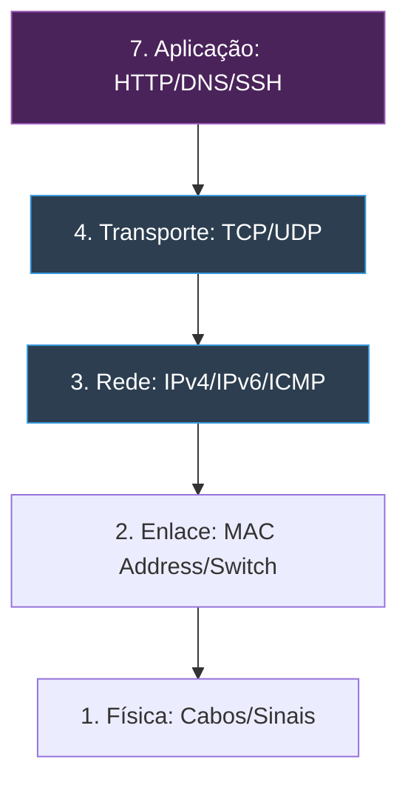

# 🌐 Redes de Computadores: Master Class Edition

Domine a espinha dorsal da internet. Do modelo OSI ao troubleshooting avançado, este é o conhecimento que separa curiosos de profissionais que mantêm o mundo conectado.

---

## 📂 Módulo 1: Arquitetura de Redes (Modelo OSI & TCP/IP)

O conhecimento de redes começa na compreensão de como os dados são empacotados e enviados.

### 1.1 O Processo de Encapsulamento
Imagine o envio de um e-mail:
1.  **Aplicação:** O dado é gerado.
2.  **Transporte:** O dado recebe uma "porta" (ex: 443).
3.  **Rede:** O dado recebe o "IP de destino".
4.  **Enlace:** O dado recebe o "MAC Address do roteador".
5.  **Física:** O dado vira pulsos elétricos no cabo.

---

## 🔢 Módulo 2: Endereçamento e Subnetting (A Matemática da Rede)

Calcular IPs e máscaras é a habilidade mais técnica de um administrador de redes.

### 2.1 CIDR vs Máscara de Subrede
| Típico | CIDR | Máscara | IPs Totais | Hosts Usáveis |
| :--- | :--- | :--- | :--- | :--- |
| Doméstico | `/24` | `255.255.255.0` | 256 | 254 |
| Pequeno | `/25` | `255.255.255.128` | 128 | 126 |
| Provedor | `/30` | `255.255.255.252` | 4 | 2 |

::: tip 💡 Cálculo Rápido de Hosts
Para saber quantos computadores cabem na rede, use a fórmula: **2^n - 2**. 
Onde `n` é o número de bits restando no IP (ex: no `/24`, sobram 8 bits. 2^8 = 256. Menos 2 (Rede e Broadcast) = 254).
:::

### 2.2 IPs Privados (RFC 1918)
Nunca use IPs públicos na sua rede local.
- **Classe A:** 10.0.0.0 até 10.255.255.255
- **Classe B:** 172.16.0.0 até 172.31.255.255
- **Classe C:** 192.168.0.0 até 192.168.255.255

---

## ⚙️ Módulo 3: Protocolos Essenciais (DORA e DNS)

### 3.1 DHCP: Como o IP chega no PC? (Processo DORA)
1.  **Discover:** O PC grita na rede: "Alguém me dá um IP?"
2.  **Offer:** O Roteador responde: "Eu tenho esse aqui: 192.168.1.10."
3.  **Request:** O PC diz: "Eu aceito esse IP!"
4.  **Acknowledge:** O Roteador confirma: "Beleza, agora ele é seu por 24h."

### 3.2 DNS: A Agenda da Internet
Sem o DNS, você teria que digitar `142.250.217.110` para abrir o Google.
- **Porta:** 53 (UDP para consultas rápidas, TCP para transferências).
- **Tipos de Registro:**
    - `A`: Aponta para um IP.
    - `CNAME`: Aponta para outro nome (apelido).
    - `MX`: Servidor de E-mail.

---

## 🔍 Módulo 4: Troubleshooting Avançado (Wireshark & Netstat)

### 4.1 Captura de Pacotes (Wireshark)
O Wireshark é o "Raio-X" da rede. Use-o para ver se as senhas estão passando sem criptografia (Protocolos HTTP, FTP, Telnet).

### 4.2 Comandos Indispensáveis no Terminal
| Comando | O que revela? |
| :--- | :--- |
| `ipconfig /all` | Nome, MAC, DNS, IP - Tudo. |
| `netstat -ano` | Lista todas as portas abertas e quem está usando. |
| `tracert [IP]` | Mostra por onde o pacote está passando até o alvo. |
| `arp -a` | Mostra a tabela de endereços físicos (MAC) conhecidos. |

::: info 🛡️ Caso Real: O Gateway Fantasma
Um técnico demorou 2 dias para consertar uma rede. O PC pegava IP, mas não navegava. Usei o `tracert 8.8.8.8` e vi que o pacote morria no primeiro salto. O culpado era o **Gateway Padrão** que estava configurado como `.2` mas o roteador real era o `.1`. Matamos o problema em 10 segundos.
:::

---

## 🔐 Módulo 5: Segurança e Infraestrutura de Redes

### 5.1 Switch vs Roteador
- **Switch (Camada 2):** Une equipamentos na **mesma rede** através do MAC Address.
- **Roteador (Camada 3):** Une **redes diferentes** através do IP.

### 5.2 VLANs (Virtual LANs)
Use VLANs para separar os departamentos. O Wi-fi de visitantes e os Computadores da Diretoria **não devem se enxergar**. Isso impede que um vírus em um computador infecte a empresa toda.

---

### Links de Referência Master
- [🐧 Domínio do Linux](/guias/Curso_Dominio_Linux) - Redes no terminal Linux.
- [💀 Kali Linux Expert](/guias/Curso_Pratico_Kali_Expert) - Ataques a redes.
- [🏢 Windows Server & AD](/guias/Curso_Windows_Server_AD) - Administração DHCP/DNS.
