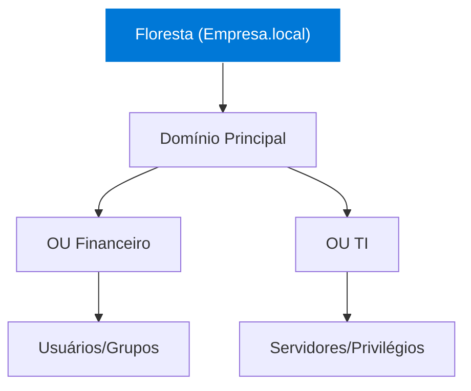

# 🏢 Windows Server & Active Directory: Master Class Edition


O cérebro da rede corporativa. Aprenda a gerenciar identidades, políticas de grupo e infraestrutura crítica de nível empresarial. Este guia transforma você em um administrador capaz de gerenciar redes de 10 a 10.000 usuários.

---

## 📂 Módulo 1: Arquitetura de Domínio (AD DS)

O Active Directory Domain Services é o banco de dados que armazena objetos e gerencia a segurança da rede.

### 1.1 A Hierarquia de Confiança
- **Floresta (Forest):** O limite máximo de segurança. Contém todas as árvores e domínios.
- **Árvore (Tree):** Conjunto de domínios que compartilham o mesmo espaço de nome (ex: `matriz.local` e `filial.matriz.local`).
- **Domínio (Domain):** Onde os objetos (Usuários, PCs) residem.
- **Unidade Organizacional (OU):** Pastas para organizar objetos e aplicar GPOs específicas.



---

## ⚙️ Módulo 2: Serviços de Infraestrutura (DNS e DHCP)

O Windows Server não apenas autentica usuários; ele gerencia como as máquinas se acham na rede.

### 2.1 DNS Integrado ao AD
No Windows, o DNS é vital. Sem ele, o PC não acha o Controlador de Domínio (DC).
- **Zonas de Pesquisa Direta:** Converte Nome -> IP.
- **Zonas de Pesquisa Inversa:** Converte IP -> Nome.

### 2.2 DHCP Server
Gerenciamento centralizado de endereços.
- **Escopos:** Defina o range de IPs.
- **Reservas:** Garanta que a impressora sempre pegue o mesmo IP (`.10`) através do MAC Address.

---

## 🛠️ Módulo 3: GPO (Group Policy Objects)

A mágica da administração centralizada. Configure 1.000 máquinas com um clique.

### 3.1 Ordem de Precedência (LSDOU)
Se houver conflito de políticas, a ordem de aplicação é:
1.  **L**ocal (PC Local)
2.  **S**ite (Geográfico)
3.  **D**omínio (Lógica Geral)
4.  **OU** (Unidade Organizacional) - **A última aplicada é a que vale!**

### 3.2 GPOs Indispensáveis
- **Restrição de USB:** Bloqueia pen-drives não autorizados por segurança.
- **Mapeamento de Drives:** Z: para Arquivos, Y: para Scans.
- **Configuração de Proxy:** Garante que todos naveguem pelo Firewall da empresa.

---

## 🔍 Módulo 4: Troubleshooting e PowerShell AD

### 4.1 Comandos de Diagnóstico
| Comando | O que faz? |
| :--- | :--- |
| `gpupdate /force` | Força a aplicação imediata das novas GPOs no PC. |
| `gpresult /r` | Mostra quais GPOs estão realmente sendo aplicadas no usuário. |
| `dcdiag` | Testa a saúde completa do Controlador de Domínio. |

### 4.2 Automação com PowerShell
Crie 50 usuários de uma vez a partir de uma planilha CSV:
```powershell
Import-Csv "usuarios.csv" | ForEach-Object {
    New-ADUser -Name $_.Name -Path "OU=Users,DC=Empresa,DC=local" -Enabled $true
}
```

::: info 🛡️ Caso Real: O Servidor que Parou no Tempo
Servidores Windows que ficam muito tempo desligados perdem a "confiança" com o domínio. O erro é o clássico "The trust relationship between this workstation and the primary domain failed". **Solução:** Remova o servidor do domínio para um Grupo de Trabalho e adicione-o novamente. A conta de computador do AD será resetada e a confiança voltará.
:::

---

## 🚀 Módulo 5: Disaster Recovery e Backup do AD

::: details 🛡️ Plano de Emergência: System State (Clique para expandir)
Backup do AD não é copiar arquivos de pasta. É fazer o backup do **System State**:
1. [ ] Use o `Windows Server Backup`.
2. [ ] Selecione "System State" (inclui o Registry, Banco NTDS.dit e SYSVOL).
3. [ ] Habilite a **Lixeira do Active Directory** (Server 2008 R2+), permitindo restaurar um usuário deletado em segundos sem precisar reiniciar o servidor.
:::

---

### Links de Referência Master
- [🌐 Redes de Computadores](/guias/Curso_Redes_Computadores) - Fundamentos de IP/DNS.
- [☁️ Cloud Computing](/guias/Curso_Cloud_Computing) - Migração para Azure AD.
- [🐧 Domínio do Linux](/guias/Curso_Dominio_Linux) - Integração com Samba/LDAP.
- [🗄️ Banco de Dados Avançado](/guias/Curso_Banco_Dados_Avancado) - SQL Server em ambiente Windows.
