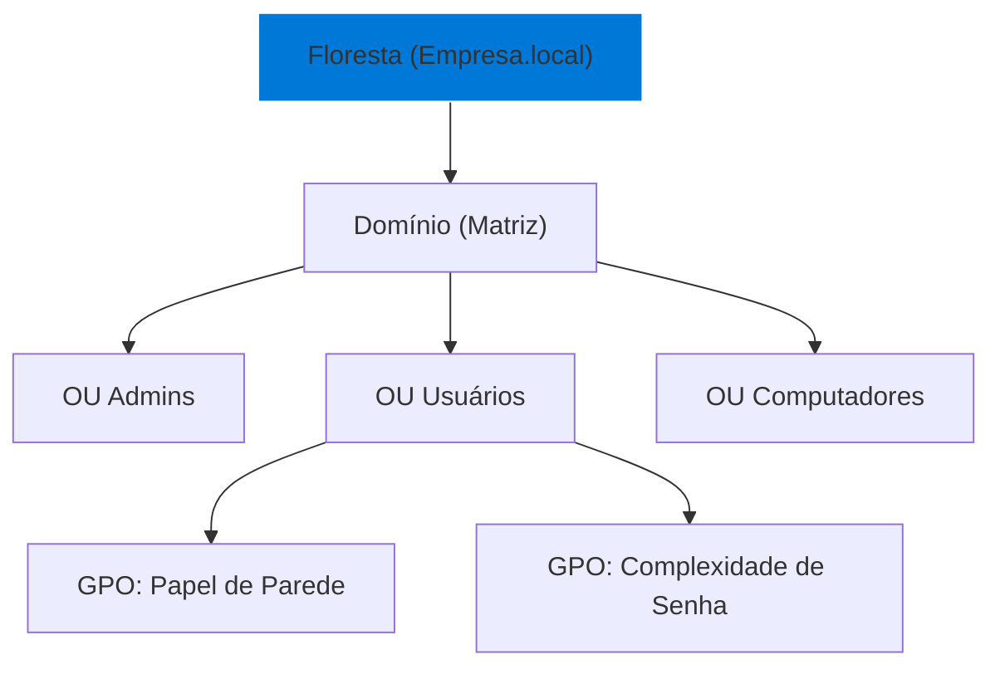

# 🏢 Windows Server & Active Directory

O cérebro da rede corporativa. Aprenda a gerenciar usuários, políticas de grupo e segurança de nível empresarial.

---

## 📂 Arquitetura do Domínio (AD)

Entenda como a hierarquia do Active Directory organiza sua empresa.

---

## 🛠️ Módulo 1: Gestão de Identidade

### O Coração do Usuário
No AD, o usuário é mais que um login; é um conjunto de permissões.

::: tip 💡 Dica do Matheus
Ao criar um novo funcionário, use a função **"Copy"** de um usuário antigo do mesmo setor. Isso garante que ele herde todos os grupos de segurança corretos sem você precisar conferir um por um.
:::

---

## 🔧 Módulo 2: GPO (Group Policy Objects)

### Dominando a Rede em Massa
As GPOs permitem que você mude uma configuração em 1000 computadores ao mesmo tempo.

| GPO Comum | O que faz | Benefício |
| :--- | :--- | :--- |
| **Map Drive** | Mapeia a letra Z: do servidor | Usuário não perde arquivos |
| **Password Policy** | Exige senhas fortes | Segurança contra ataques |
| **Software Install** | Instala o Chrome/Adobe sozinho | Ganho de tempo no suporte |

---

## 🔍 Módulo 3: Troubleshooting de Login

::: info 🛡️ Na Trincheira: Caso Real
Um setor inteiro não conseguia logar. O erro era "Trust relationship failed". **Diagnóstico:** O relógio do servidor estava 10 minutos diferente do relógio dos PCs. O Kerberos (protocolo de autenticação) bloqueia o login se a hora estiver errada. **Solução:** Ajustei o horário via NTP e todos logaram na hora.
:::

---

## 📝 Procedimento Profissional: Backup do AD

::: details 🛡️ Backup do System State (Clique para expandir)
Sempre faça backup do **System State** do Controlador de Domínio:
1. [ ] Use o `Windows Server Backup`.
2. [ ] Agende para o período da noite.
3. [ ] Garanta que o backup esteja em um disco físico diferente do sistema.
:::

---

### Links Relacionados
- [🌐 Redes de Computadores](/guias/Curso_Redes_Computadores)
- [☁️ Cloud Computing Essentials](/guias/Curso_Cloud_Computing)
