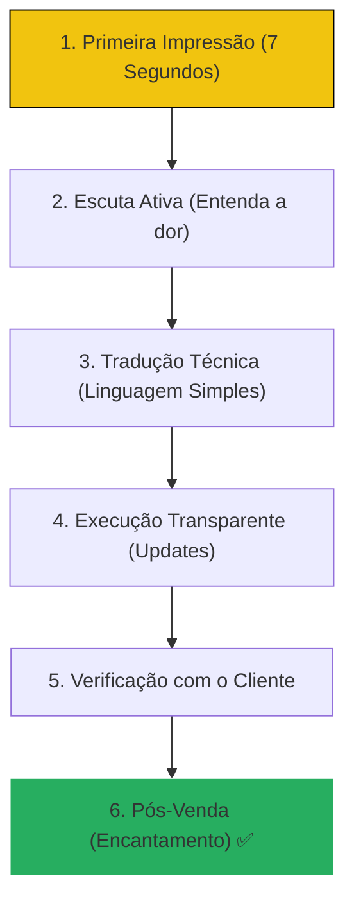

# 💬 Atendimento Técnico de Elite

Ser um técnico excelente é 50% habilidade manual e 50% habilidade humana. Este guia ensina como encantar o cliente e construir uma carreira de confiança.

---

## 📂 O Ciclo do Atendimento Perfeito

O atendimento não começa quando você liga o PC, ele começa no primeiro "Oi".

---

## 🛠️ Módulo 1: O "Dicionário" do Técnico de Elite

Pare de falar "técniquês". O cliente quer sentir que entende o que ele está pagando.

| Linguagem do Técnico | Linguagem do Cliente |
| :--- | :--- |
| "O DNS está com timeout" | "O sistema que traduz o nome dos sites está falhando" |
| "Bad sectors no HD" | "O disco de memória tem cicatrizes físicas" |
| "Vou fazer um dump do DB" | "Vou fazer uma cópia de segurança de todas as informações" |

::: tip 💡 Dica do Matheus
Sempre dê uma analogia. Se o processador está lento, diga: "É como se o cérebro estivesse com preguiça porque está com muito calor". O cliente entende na hora e valoriza seu diagnóstico.
:::

---

## 🚫 O Que NUNCA Fazer

::: danger ⚠️ Alerta de Profissionalismo
**NUNCA** faça o cliente se sentir burro. Se ele clicou num link de vírus, não diga "Como você foi clicar nisso?". Diga: "Esses links são feitos para enganar até profissionais. Vou te ensinar um truque para nunca mais cair nessa". Você ganha um cliente fiel em vez de um cliente humilhado.
:::

---

## 🔍 Módulo 2: Gestão de Expectativa

::: info 🛡️ Na Trincheira: Caso Real
Um técnico prometeu o PC para "daqui 1 hora". Levou 2 horas. O cliente ficou furioso. **Eu prometi para "daqui 4 horas"**. Entreguei em 2 horas. O cliente achou que fui um herói. **O tempo foi o mesmo**, mas a gestão da expectativa mudou tudo.
:::

---

## 📝 Procedimento Profissional: O Pós-Venda

::: details 🌟 Checklist: O Toque de Mestre (Clique para expandir)
Siga estes passos antes de sair da casa/empresa do cliente:
1. [ ] **Limpeza:** Limpou o teclado e a tela? (Isso visualmente vale mais que a formatação).
2. [ ] **Feedback:** Perguntou: "Ficou do jeito que o senhor esperava?"
3. [ ] **Contato:** Deixou seu WhatsApp para o caso de dúvidas?
4. [ ] **Lembrete:** Agendou um check-up gratuito para daqui a 6 meses?
:::

---

### Links Relacionados
- [🔍 Troubleshooting Profissional](/guias/Guia_Troubleshooting_Profissional)
- [📜 Roadmap de Certificações](/guias/Guia_Roadmap_Certificacoes)
- [🏢 Atendimento e Vendas](/guias/Guia_Troubleshooting_Carreira)
