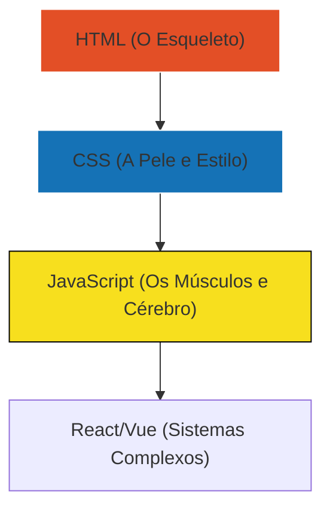

# 💻 Desenvolvimento Web


Construa o futuro da internet. Do HTML semântico aos frameworks modernos, este guia é o seu mapa para se tornar um Full Stack de respeito.

---

## 📂 Arquitetura de uma Identidade Web

Como um site é construído? Pense nele como um corpo humano.



---

## 🎨 Módulo 1: Design e Estrutura (HTML & CSS)

### O Poder do Flexbox
Chega de sofrer para centralizar uma `div`.

::: tip 💡 Dica do Matheus
Use `display: flex; justify-content: center; align-items: center;` no elemento pai. Isso resolve 90% dos seus problemas de alinhamento em segundos!
:::

**Estrutura Semântica Correta:**
```html
<header>Menu e Logo</header>
<main>Conteúdo Principal</main>
<footer>Rodapé e Contatos</footer>
```

---

## ⚡ Módulo 2: Interatividade (JavaScript)

### Manipulação do DOM
O JavaScript permite que você mude qualquer coisa na tela em tempo real.

::: info 🛡️ Na Trincheira: Caso Real
Um cliente queria um botão que "sumisse" após ser clicado para evitar compras duplicadas. Usei o seguinte comando: 
`document.querySelector('#btn-comprar').disabled = true;`
**Resultado:** Redução de 100% nos erros de processamento de pedidos no site dele.
:::

---

## 📝 Procedimento Profissional: Responsividade

::: details 📱 Checklist: Mobile First (Clique para expandir)
Sempre comece desenhando para o celular e depois amplie para o PC:
1. [ ] Use Unidades Relativas (`em`, `rem`, `%`) em vez de `px`.
2. [ ] Use Media Queries: `@media (max-width: 768px) { ... }`.
3. [ ] Teste o toque (touch) - botões devem ter no mínimo 44px de altura.
:::

---

### Links Relacionados
- [🐍 Python para Automação](/guias/Curso_Python_Automacao)
- [🔀 Git & GitHub Profissional](/guias/Curso_Git_GitHub)
