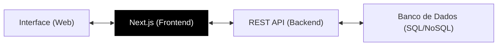

# 💻 Desenvolvimento Web: Master Class Edition


Crie o que a internet consome. Este guia leva você do HTML básico à arquitetura de aplicações fullstack modernas. Aprenda a equilibrar estética, performance e funcionalidade para construir produtos digitais de elite.

---

## 📂 Módulo 1: O Esqueleto e a Estética (HTML5 & CSS3)

### 1.1 Semântica de Elite
Não use apenas `<div>`. O Google e leitores de tela precisam entender seu site.
- `<header>`, `<nav>`, `<main>`, `<article>`, `<section>`, `<footer>`.

### 1.2 Layout Moderno (Flexbox & Grid)
- **Flexbox (1D):** Ideal para alinhar itens em linha ou coluna (menus, botões).
- **CSS Grid (2D):** O mestre dos layouts complexos. Define colunas e linhas em toda a página.

```css
/* Exemplo de Dashboard com Grid */
.container {
  display: grid;
  grid-template-columns: 200px 1fr; /* Menu lateral fixo + conteúdo */
  grid-template-rows: auto;
}
```

---

## ⚡ Módulo 2: O Cérebro do Client-side (JavaScript Moderno)

### 2.1 ES6+ e Programação Assíncrona
Manipule dados sem travar a navegação do usuário.
- **Arrow Functions:** `() => { ... }`
- **Promises e Async/Await:** Buscando dados de APIs sem "congelar" a tela.

```javascript
async function buscarDados() {
  const response = await fetch('https://api.exemplo.com/usuarios');
  const dados = await response.json();
  console.log(dados);
}
```

---

## 🏗️ Módulo 3: Da Landing Page à App (Frameworks)

A web moderna é construída em componentes reutilizáveis.
- **React.js / Next.js:** O padrão do mercado para interfaces dinâmicas.
- **Vite:** A ferramenta de desenvolvimento mais rápida da atualidade.
- **Tailwind CSS:** Estilização ultra-rápida através de classes utilitárias.



---

## ⚙️ Módulo 4: Backend e APIs (O Lado Oculto)

Um site bonito sem dados é apenas uma casca.
- **RESTful APIs:** O padrão de comunicação via HTTP.
- **Status Codes:**
    - `200`: Sucesso.
    - `201`: Criado com sucesso.
    - `401`: Não autorizado (Faltou login).
    - `404`: Não encontrado.
    - `500`: Erro no servidor.

---

## 🔍 Módulo 5: Performance e SEO (Otimização)

### 5.1 O Teste de Fogo (Lighthouse)
O Google penaliza sites lentos. Seus pilares devem ser:
1.  **LCP (Largest Contentful Paint):** Velocidade de carregamento visual.
2.  **FID (First Input Delay):** Rapidez de resposta ao clique.
3.  **CLS (Cumulative Layout Shift):** Estabilidade visual (o site não fica "pulando" enquanto carrega).

::: info 🛡️ Na Trincheira: Caso Real
Um e-commerce estava perdendo vendas em dispositivos móveis. As imagens eram gigantes (5MB cada). **Solução:** Implementei o formato **WebP** e o "Lazy Loading". O carregamento caiu de 12s para 3s e as vendas subiram 40%. **Performance é dinheiro.**
:::

---

## 🚀 Módulo 6: Deploy e Sincronização (GitFlow)

::: details 🛠️ Checklist: Deploy de Elite (Clique para expandir)
Sincronize seu código com o mundo:
1. [ ] **Git:** Use o comando `git push origin main`.
2. [ ] **CI/CD:** Use Vercel ou Netlify para deploy automático a cada alteração.
3. [ ] **SSL:** Garante que o site tenha o "cadeado" HTTPS (Vital para segurança).
:::

---

### Links de Referência Master
- [🔀 Git & GitHub Profissional](/guias/Curso_Git_GitHub) - Essencial para Web.
- [🐍 Python para Automação](/guias/Curso_Python_Automacao) - Crie robôs que interagem com o navegador.
- [🗄️ Banco de Dados Avançado](/guias/Curso_Banco_Dados_Avancado) - Armazene os dados do seu site.
- [🎨 POO na Prática](/guias/Curso_POO_Pratica) - Organize seu código JS por objetos.
