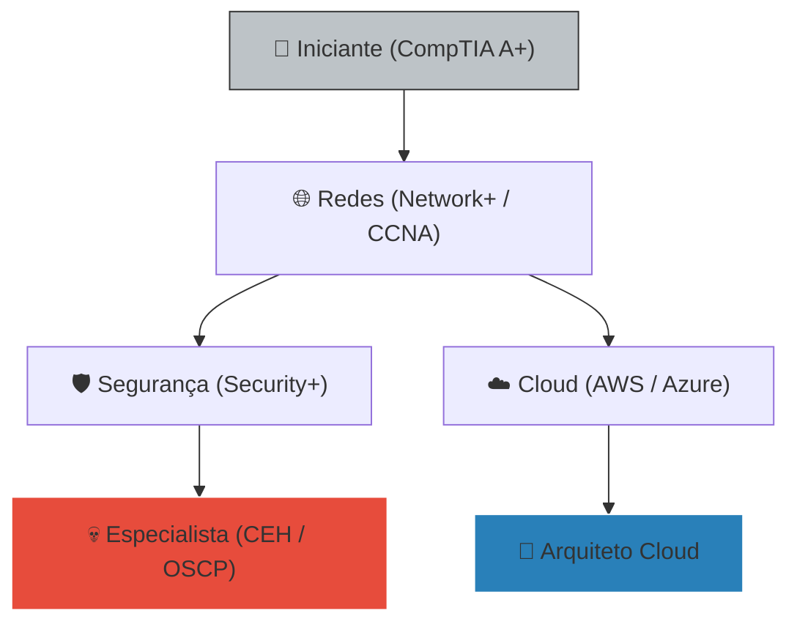

# 📜 Guia: Roadmap de Certificações IT

No mundo da TI, o diploma abre portas, mas a certificação prova que você sabe atravessá-las. Planeje sua evolução para ganhar mais e trabalhar melhor.

---

## 🛤️ A Escada da Valorização

Qual certificação tirar primeiro? Siga a ordem lógica para não desperdiçar dinheiro.

---

## 💰 Retorno sobre Investimento (ROI)

Quanto vale o seu esforço? Certificações aumentam seu salário médio no Brasil conforme o mercado:

| Certificação | Cargo | Salário Médio Estimado |
| :--- | :--- | :--- |
| **CompTIA A+** | Suporte Técnico | R$ 2.500 - 4.500 |
| **CCNA (Cisco)** | Analista de Redes | R$ 5.500 - 8.500 |
| **AWS Solutions** | Arquiteto Cloud | R$ 10.000 - 18.000 |
| **Security+** | Analista de Seg. | R$ 6.000 - 12.000 |

---

## ⚡ Módulo 1: Estratégia de Estudo

::: tip 💡 Dica do Matheus
Não tente tirar 5 certificações ao mesmo tempo. Foque em **UMA** por vez. O segredo é: use simulados (Dumps) para entender como a prova pergunta, mas aprenda a prática no laboratório.
:::

---

## 🛡️ O Poder da CompTIA

::: info 🛡️ Na Trincheira: Caso Real
Em uma entrevista para uma multinacional, havia 50 candidatos. Apenas 2 tinham o **Security+**. Eu era um deles. O entrevistador nem perguntou meu histórico escolar; ele foi direto para o "O que você sabe sobre firewalls?". A certificação foi meu passaporte para a vaga.
:::

---

## 📝 Procedimento Profissional: O Ciclo de Estudo

::: details 📚 Checklist: Rumo ao Certificado (Clique para expandir)
Siga este roteiro para não reprovar:
1. [ ] **Videoaulas:** Assista um curso completo (Udemy/Professor Messer).
2. [ ] **Labs:** Monte o servidor/rede no VirtualBox e faça funcionar.
3. [ ] **Simulados:** Acerte pelo menos 90% dos simulados antes de pagar a prova.
4. [ ] **Voucher:** Procure cupons de desconto no Reddit (r/CompTIA).
:::

---

### Links Relacionados
- [☁️ Cloud Computing Essentials](/guias/Curso_Cloud_Computing)
- [🛡️ Kali Linux Mastery](/guias/Curso_Pratico_Kali_Expert)
- [💬 Atendimento Técnico de Elite](/guias/Guia_Atendimento_Elite)
