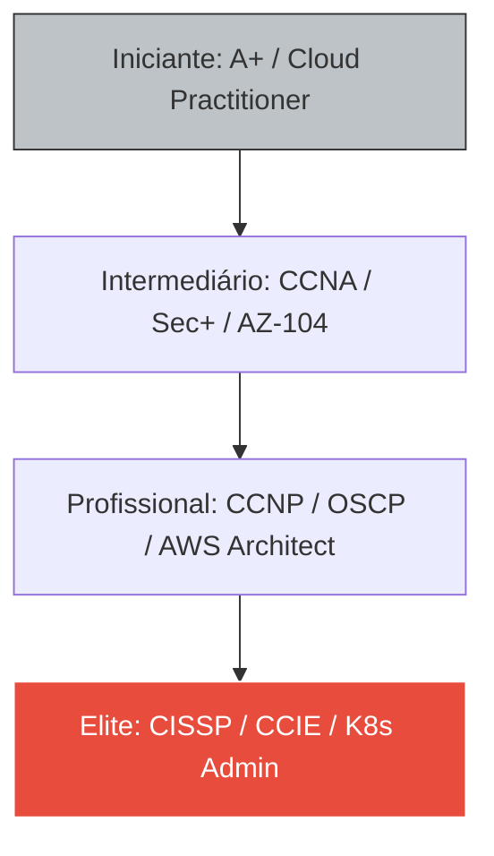

# 📜 Roadmap de Certificações IT: Master Class Edition

No mundo da TI, o diploma abre portas, mas a certificação prova que você sabe atravessá-las. Planeje sua evolução para ganhar em escala global e trabalhar com as tecnologias que moldam o futuro. Este guia é o seu GPS para a liberdade financeira e técnica.

---

## 🛤️ Módulo 1: A Escada da Valorização Profissional

O mercado valoriza especialistas. Tentar saber tudo o torna um "pato" (nada, voa e anda, mas nada faz bem). Escolha sua trilha.

### 1.1 A Fundação (Obrigatório para Todos)
Antes de se especializar, você deve dominar o hardware e a rede básica.
- **CompTIA A+:** Prova que você entende o PC.
- **CompTIA Network+ or CCNA:** Prova que você entende como os pacotes viajam.

---

## 🛡️ Módulo 2: Trilhas de Carreira de Alta Performance

### 2.1 Trilha: Segurança Cibernética (Pentest & Blue Team)
1. **Security+ (CompTIA):** A base ética e técnica.
2. **CySA+ (CompTIA):** Analista de defesa.
3. **OSCP (OffSec):** O selo de elite para Pentesters (prova 100% prática de 24h).

### 2.2 Trilha: Cloud & DevOps (Onde o dinheiro está)
1. **AZ-900 / AWS Cloud Practitioner:** Introdução.
2. **AZ-104 (Azure Admin) / AWS Solutions Architect:** O administrador do dia a dia.
3. **CKA (Certified Kubernetes Administrator):** Especialista em containers e escala.

---

## 💰 Módulo 3: O Impacto Financeiro (ROI)

Quanto vale o seu esforço? Certificações aumentam seu salário médio no mercado global:

| Certificação | Foco | Salário Médio (Brasil) | Salário Médio (Global - Remote) |
| :--- | :--- | :--- | :--- |
| **CCNA** | Redes | R$ 5.500 - 8.500 | $ 60k - 80k USD/ano |
| **AWS Solutions** | Cloud | R$ 10.000 - 18.000 | $ 90k - 130k USD/ano |
| **OSCP** | Pentest | R$ 12.000 - 22.000 | $ 100k - 150k USD/ano |
| **CISSP** | Gestão | R$ 18.000 - 35.000 | $ 140k - 200k USD/ano |

---

## 🧠 Módulo 4: Metodologia de Estudo de Elite

Estudar para certificação não é ler PDF. É **Treinamento de Combate**.

### 4.1 Técnica de Feynman (Aprenda Ensinando)
Tente explicar o protocolo OSPF para um leigo ou para a "borracha de pato" na mesa. Se você não consegue simplificar, você não entendeu. Por isso a sua **Wiki** é sua maior ferramenta de estudo!

### 4.2 Repetição Espaçada (ANKI)
Use cartões de memória (Flashcards) para decorar portas (DNS:53, HTTPS:443) e comandos complexos. O cérebro esquece o que não usa; o Anki lembra você na hora certa.

### 4.3 O Homelab (A Arena)
Não faça a prova sem ter quebrado e consertado o serviço no seu próprio laboratório VMware/VirtualBox.

---

## 📝 Módulo 5: Resiliência e Mindset

::: info 🛡️ Na Trincheira: Caso Real
Muitos desistem na primeira reprovação. Uma reprovação no CCNA não é o fim; é um "Relatório de Falhas" pago. A Cisco te diz exatamente onde você errou (ex: OSPF ou Subnetting). Volte, estude apenas aquele ponto e massacre na próxima. **Certificação é resistência.**
:::

::: tip 💡 Dica Master
Empresas multinacionais usam filtros automáticos no currículo. Se você não tem as siglas (CCNA, Sec+, AZ-900), seu currículo nem chega nos olhos do humano. **Tire a certificação para passar do robô, mostre a Wiki para convencer o humano.**
:::

---

### Links de Referência Master
- [☁️ Cloud Computing](/guias/Curso_Cloud_Computing) - Comece por aqui.
- [💀 Kali Linux Expert](/guias/Curso_Pratico_Kali_Expert) - Foco em OSCP.
- [🌐 Redes de Computadores](/guias/Curso_Redes_Computadores) - Foco em CCNA.
- [💬 Atendimento Técnico de Elite](/guias/Guia_Atendimento_Elite) - Passe na entrevista.
