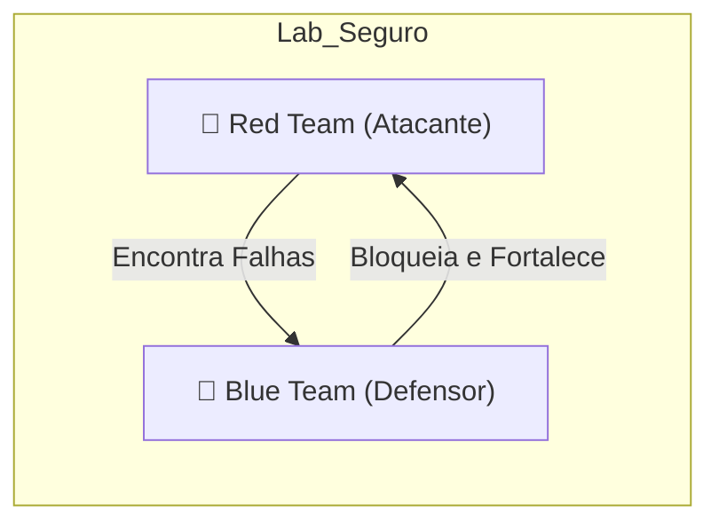

# 🛡️ Kali Linux: Master Cheat Sheet

Acesso rápido aos comandos mais potentes do Kali Linux. Tenha este guia aberto em uma segunda tela durante seus laboratórios.

---

## 📶 Audiência Wi-Fi (Aircrack-ng)
```bash
airmon-ng start wlan0    # Coloca placa em modo monitor
airodump-ng wlan0mon     # Lista redes próximas
aireplay-ng --deauth 0   # Derruba dispositivos para capturar o Handshake
```

## 🌐 Ataque Web (Burp & SQLmap)
| Ferramenta | Objetivo | Comando Pro |
| :--- | :--- | :--- |
| **SQLmap** | Invasão de DB | `sqlmap -u "url" --batch --dbs` |
| **Gobuster** | Pastas ocultas | `gobuster dir -u url -w wordlist` |
| **Burp Suite** | Interceptação | Abrir GUI e configurar Proxy 127.0.0.1:8080 |

## 🔐 Quebra de Senhas (John & Hydra)
::: tip 💡 Dica do Matheus
O Kali já vem com a melhor wordlist do mundo: `/usr/share/wordlists/rockyou.txt.gz`. Use `gunzip` para descompactar antes de usar com o John ou Hydra!
:::

**John the Ripper (Offline):**
`john --format=nt --wordlist=rockyou.txt minhas_senhas.txt`

**Hydra (Online - Brute Force):**
`hydra -L usuários.txt -P rockyou.txt [IP] ssh`

---

## 🎯 Metodologia Attacker vs Defender



---

### Links Relacionados
- [💀 Kali Linux Mastery](/guias/Curso_Pratico_Kali_Expert)
- [🔀 Git & GitHub](/guias/Curso_Git_GitHub)
