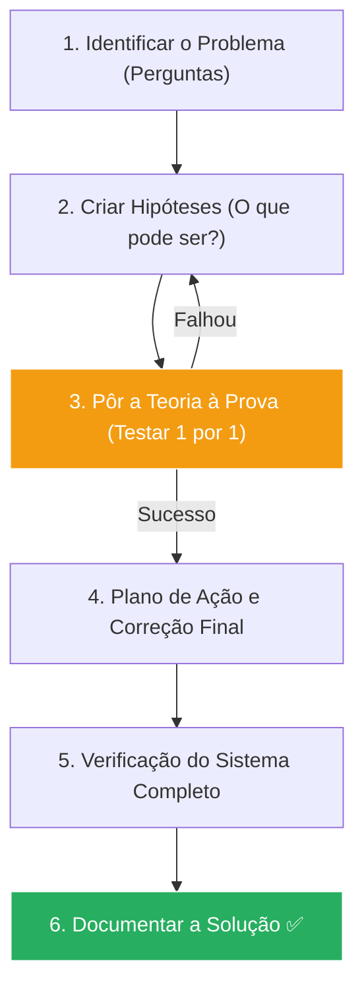

# 🔍 Troubleshooting Profissional: Master Class Edition

Diagnosticar é a arte de aplicar a lógica pura sob pressão. Este guia ensina o método científico para resolver qualquer erro de TI, do mais simples travamento ao colapso total de um data center. Aprenda a não apenas "consertar", mas a dominar o sistema.

---

## 📂 Módulo 1: O Ciclo do Diagnóstico Científico

Técnicos amadores "chutam" soluções. Profissionais de elite testam hipóteses.

---

## 🧠 Módulo 2: Desvendando a Raiz (A Técnica dos 5 Porquês)

Nunca aceite o primeiro sintoma como a causa.
1.  **Problema:** O servidor de arquivos caiu. (Por quê?)
2.  **Resposta:** O disco está cheio. (Por quê?)
3.  **Resposta:** Os logs de erro cresceram demais. (Por quê?)
4.  **Resposta:** O script de limpeza não rodou. (Por quê?)
5.  **Causa Raiz:** O agendador de tarefas foi desativado por um vírus ou erro humano.

::: info 🛡️ Diferença Vital: Sintoma vs Causa
Limpar o disco (Sintoma) resolve o problema por 1 dia. Reativar o script (Causa) resolve para sempre.
:::

---

## 📜 Módulo 3: Interpretando os Logs (O Diário Secreto)

O computador sempre registra o que está acontecendo. Aprenda a ler os sinais.

### 3.1 Windows Event Viewer (Visualizador de Eventos)
- **Crítico/Erro:** Algo parou. Foque no **ID do Evento** e pesquise no Google.
- **Aviso (Warning):** O sistema está "avisando" que algo vai cair em breve.

### 3.2 Linux Journalctl / dmesg
- `journalctl -u nginx`: Vê apenas os erros do site.
- `dmesg -T | grep -i "error"`: Vê erros físicos (Discos, USB, Memória).

---

## 🛠️ Módulo 4: O Caminho da Isolação

Se o problema é complexo, comece a remover peças do quebra-cabeça.
- **Isolamento de Hardware:** O PC trava? Dê boot por um **Live Linux no Pendrive**. Se continuar travando, o erro é **físico** (Hardware). Se não travar, o erro é de **software** (Windows/Driver).
- **Modo de Segurança:** Carrega apenas o mínimo. Se o erro sumir, o culpado é um programa que inicializa junto com o Windows.

---

## 🚑 Módulo 5: Gestão de Crise e Atendimento

Como se portar quando o sistema de um cliente inteiro cai:
1.  **Transparência:** Informe que já identificou o problema.
2.  **Prazos Reais:** Não prometa "5 minutos" se vai levar 1 hora.
3.  **Foco:** Resolva primeiro o que é mais crítico (O motor), depois o que é estético (A pintura).

::: info 🛡️ Na Trincheira: Caso Real
Um escritório de advocacia parou. Todos os PCs davam "Erro de Rede". Em vez de mexer nos PCs, fui direto no **Switch Central**. Notei que todas as luzes piscavam em sincronia (Broadcast Storm). Um estagiário tinha ligado as duas pontas do mesmo cabo no switch, criando um "Loop". Removi o cabo e a rede voltou em 2 segundos. **Visão sistêmica ganha o jogo.**
:::

---

### Links de Referência Master
- [🏢 Windows Server & AD](/guias/Curso_Windows_Server_AD) - Erros de domínio.
- [🛡️ Atendimento Técnico de Elite](/guias/Guia_Atendimento_Elite) - Como falar com o cliente.
- [🖥️ Montagem e Manutenção](/guias/Curso_Montagem_Manutencao_PC) - Erros de hardware.
- [🛠️ Ferramentas Pen-drive](/guias/Curso_Ferramentas_Pendrive) - Kit de sobrevivência.
