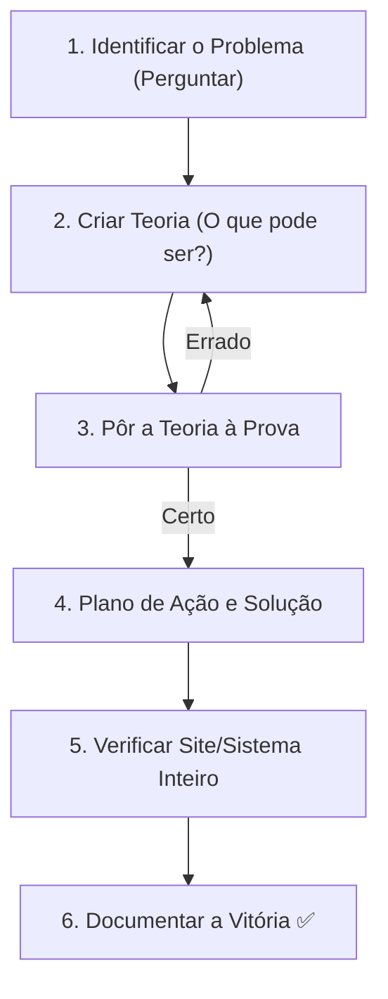

# 🔍 Guia: Troubleshooting Profissional

Diagnosticar é uma arte baseada em lógica. Este guia ensina o método científico para resolver qualquer erro de TI, do mais simples ao mais complexo.

---

## 📂 Ciclo do Diagnóstico de Elite

Não "tente" soluções aleatórias. Siga o método:

---

## 🛠️ Módulo 1: O Poder das Perguntas Corretas

Metade da solução está em entender o que aconteceu.

::: tip 💡 Dica do Matheus
Sempre pergunte ao usuário: **"O que mudou no PC desde a última vez que funcionou?"**. Geralmente a resposta é: "Instalei um programa novo" ou "Caiu a luz". Isso já te dá o caminho da solução.
:::

---

## 🔧 Módulo 2: Ferramentas de Análise Mental

| Sintoma | Possíveis Causas | Primeira Ferramenta |
| :--- | :--- | :--- |
| **PC reinicia do nada** | Fonte ou Superaquecimento | HWiNFO64 (Temp) |
| **Internet não abre nada** | DNS ou Gateway | `ping 8.8.8.8` |
| **Programa trava erro X** | Arquivo corrompido ou DLL | Event Viewer (Logs do Windows) |

---

## 🔍 Módulo 3: Casos de Suporte "Nível Hard"

::: info 🛡️ Na Trincheira: Caso Real
Um programa financeiro parou de funcionar em um único PC. Reinstalei e nada. Usei o **Process Monitor (Sysinternals)** e vi que o programa tentava ler uma pasta que o antivírus tinha bloqueado por engano. **Solução:** Criei uma exclusão no antivírus e o programa voltou na hora.
:::

---

## 📝 Regra de Ouro do Técnico de Elite

::: warning ⚠️ Regra de Ouro
**Nunca mude duas coisas ao mesmo tempo.** Se você mudar o cabo E trocar o IP, não saberá qual deles era o problema. Mude uma coisa, teste. Não deu? Volte a configuração original e tente outra.
:::

---

### Links Relacionados
- [🏢 Windows Server & AD](/guias/Curso_Windows_Server_AD)
- [🛡️ Atendimento Técnico de Elite](/guias/Guia_Atendimento_Elite)
